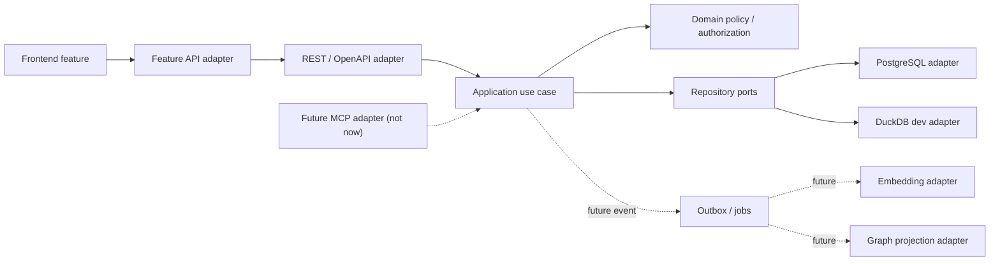

# Analysis Canvas 구조 점검 및 리팩터링 로드맵 v2

문서 기준일: 2026-08-13
대상 환경: WSL2 Ubuntu 개발 → Rocky Linux 8 운영, Docker 미사용
문서 목적: 복원 직후 기준선을 안정화하고, 현재 기능을 보존하면서 프런트엔드·백엔드 구조를 점진적으로 분리한다.

## 1. 결론

복원 기준선의 CRLF/Corepack/Python lock, FastAPI `TestClient`, DuckDB 직렬화 문제를 안정화했고 전체 backend 및 Playwright 회귀를 다시 녹색으로 만들었다. 이후 실제 계약이 있는 `projects`, `products`, `requests`, `results`, `reports`를 대표 vertical slice로 분리했다. canonical 데이터 계약이 없는 `materials`와 `parts`는 추측성 계층을 만들지 않고 중단 조건으로 남겼다.

프런트엔드와 백엔드는 공통 도메인 언어만 맞추고 내부 구조를 기계적으로 같게 만들지 않는다. 프런트엔드는 화면·상태·API adapter 중심이고 백엔드는 HTTP·use case·domain·persistence 중심이므로 내부 층은 달라야 한다. 현재 패키지는 안전하게 검증 가능한 경계를 마감했으며, `App.tsx` 400줄 이하와 모든 backend endpoint/DTO의 완전 이전은 후속 부채로 명시한다.

MCP, Embedding, Graph DB는 이번 리팩터링에서 구현하지 않는다. 이후 다음 데이터 흐름을 안전하게 연결할 수 있도록 백엔드 application service와 공용 식별자·권한·provenance 경계만 준비한다.

### 구현 상태 — 2026-08-14

- Phase 0~1: runtime lock, PostgreSQL app/owner role preflight, test 계층·아키텍처/OpenAPI CI guard를 구현했다. DuckDB는 local development compatibility adapter로만 유지한다.
- Phase 2: `projects`, `products`, `results`, `reports` read, `requests` assignee 변경의 representative vertical slice를 HTTP → application → domain port → SQL adapter로 옮겼다. Materials/Parts는 canonical table/API contract가 없어 보류한다.
- Phase 3: shell/sidebar/topbar, route registry, StrictMode-safe bootstrap machine, versioned UI preferences와 data/schema/variables/automation/workflow/results/report editor의 lazy feature boundary를 구현했다. 비기본 access/workbench route는 hover·focus preload가 있는 lazy module로 분리했고 report export session은 전용 controller/dialog가 소유한다. `App.tsx`는 2,366→1,076줄, main JS는 약 961→714 KB로 감소했다. 목표 400줄 이하와 남은 dashboard/bootstrap controller의 feature state 소유권 이동은 후속이다.
- Phase 4: generated source를 `shared/api/generated`로 단일화하고 인증·401/403·오류 처리를 중앙 client가 소유한다. `api.ts`와 workbench client의 raw `/api/` 문자열은 0으로 잠갔고, caller 지정 generic cast를 금지해 named response adapter만 사용하도록 architecture gate를 추가했다. Report layout 6개 success response는 concrete named schema로 보강했다. 다만 JSON success response 87개는 아직 anonymous schema이므로, 해당 response model 보강 전 generated DTO 단일 계약이 완전하다고 간주하지 않는다.
- Phase 5: PostgreSQL startup은 Alembic table preflight만 수행하도록 했고, 현재 fixture seed는 명시 command `seed_database.py --mode reference`로 분리했다. `reference`와 `demo`는 아직 동일 fixture alias이므로 운영 reference data 분리는 후속 제품 결정이다. DuckDB historic DDL 전체 이동은 하지 않고 development bootstrap adapter entry만 만들었다.
- Phase 6: vendor-free report/knowledge/MCP protocol ADR을 추가했다. 실제 MCP, graph, embedding, worker는 구현하지 않았다.

검증에서 기본 backend suite 176개가 통과하고 3개 PostgreSQL opt-in test가 skip됐다. 별도의 disposable PostgreSQL 18 cluster를 blank DB에서 migration·권한 hardening·reference seed까지 구성한 뒤 app-role profile 60개가 통과했고, canonical 6-step workflow가 suite 전후 동일함을 확인했다. frontend architecture/API/preferences self-test, TypeScript와 production build가 통과했으며 fresh backend/Vite/Chromium을 사용한 Playwright 20개도 모두 통과했다. 실제 Rocky 서버 값·TLS·service user가 없어 운영 배포는 수행하지 않았고, 로컬 credential 파일의 과거 과도한 권한 노출에 대해서는 비밀번호 회전이 별도 운영 조치로 남아 있다. 이 외부 검증 상태는 코드 contract와 구분한다.

```text
부품 정보 + 소재 물성 정보 + 제품 정보 + 프로젝트 정보 + 해석/판정 데이터
                              ↓
                         종합 보고서 생성
```

## 2. 2026-08-13 기준선 점검 결과

### 2.1 정상 확인

- 저장소는 `/home/wgcha/projects/simdashboard`의 WSL 네이티브 파일시스템에 있다.
- Git은 upstream과 `0 ahead / 0 behind`다. 다만 복원 과정의 미커밋 변경이 남아 있다.
- Node.js `v22.23.2`, Python `3.12.13`, 백엔드 핵심 import가 동작한다.
- 프런트 TypeScript 및 Vite production build가 성공한다.
- Linux lifecycle/PostgreSQL shell script의 `bash -n` 검사가 통과한다.
- Alembic head는 `0008_media_blob_storage` 하나다.

### 2.2 즉시 해결해야 할 기준선 결함

| ID | 증거 | 영향 | 우선순위 |
|---|---|---|---|
| ENV-101 | `pnpm --version`이 Corepack의 `pnpm/latest` 온라인 조회를 시도하다 실패 | 오프라인/사내망에서 setup·start·CI 재현 불가 | P0 |
| ENV-102 | 복원 변경 파일이 CRLF로 바뀌어 `git diff --check`가 대량 실패 | 실제 코드 변경과 줄끝 변경이 섞이고 shell/생성물 diff가 오염됨 | P0 |
| TEST-101 | 빈 FastAPI 앱도 `TestClient.__enter__()`에서 멈춤 | 백엔드 API 테스트 107개 중 6개 이후 진행 불가 | P0 |
| DB-101 | Playwright E2E 중 DuckDB `Unique file handle conflict` 발생 | 20개 E2E 중 11 통과, 9 실패; API 500과 전역 오류 화면 발생 | P0 |
| PG-101 | `.env`는 PostgreSQL `127.0.0.1:5432/simulation_dashboard`를 가리키지만 PostgreSQL 18 cluster가 `down` | WSL PostgreSQL 실제 연결·권한·마이그레이션을 검증하지 못함 | P0 |
| FE-101 | production main JS 약 959 KB, CSS 약 235 KB; Vite chunk warning | 초기 로드·변경 충돌·테마 회귀 위험 | P1 |

`TestClient` 교착은 앱 코드나 DuckDB 초기화 없이도 재현되므로 dependency/runtime 문제로 분리한다. 현재 설치 조합은 FastAPI 0.115.12, Starlette 0.46.2, HTTPX 0.28.1, AnyIO 4.14.2다. 직접/전이 의존성을 lock하지 않은 것이 복원 후 조합 변화의 원인이 될 수 있다. 버전 하나를 임의로 내리기보다 호환 행렬을 작은 재현 테스트로 확인하고 lockfile을 생성한다.

### 2.3 구조 부채 수치

| 영역 | 현재 수치 | 판단 |
|---|---:|---|
| `backend/app/main.py` | 2,922줄, endpoint 71개, `.execute()` 218곳 | HTTP·권한·SQL·보고서 처리·도메인 규칙이 결합됨 |
| 전체 router/main SQL | `.execute()` 321곳 | router가 transaction/use case를 직접 소유함 |
| `backend/app/database.py` | 2,358줄 | runtime schema, DuckDB 보정, seed, 기본 콘텐츠가 한 파일에 결합됨 |
| `backend/app/routers/access_control.py` | 867줄 | 권한 API와 SQL/transaction 경계가 큼 |
| `backend/app/routers/workbench.py` | 672줄 | workflow 상태 전이와 SQL이 router에 남아 있음 |
| `frontend/src/App.tsx` | 2,366줄, `useState` 74개, `useEffect` 31개 | app shell·라우팅·feature 화면·data orchestration이 결합됨 |
| `frontend/src/styles.css` | 1,698줄, raw color 선언 다수 | feature 스타일과 전역 테마의 소유권이 불명확함 |
| `frontend/src/api.ts` | 수동 API 약 81개 | OpenAPI 생성 client와 URL/DTO 계약이 중복됨 |
| `frontend/src/reportExport.ts` | 922줄 | report model, layout, 데이터 변환, PPTX renderer, I/O가 결합됨 |

## 3. 목표 원칙

### 3.1 공통 도메인 언어만 정렬한다

프런트와 백의 최상위 feature/domain 이름은 가능한 범위에서 맞춘다.

| 공통 도메인 | 프런트 책임 | 백엔드 책임 |
|---|---|---|
| `projects` | 프로젝트 목록·상세·선택·편집 UI | project use case, scope, repository |
| `products` | 제품 정보 조회·편집 UI | product aggregate와 조회/변경 service |
| `materials` | 소재·물성 카탈로그 UI | material/property 모델과 repository |
| `parts` | 부품/BOM/연결 UI | part·assembly 관계와 validation |
| `requests` | 의뢰 접수·workflow UI | request/work item 상태 전이 |
| `results` | import·분석·비교·판정 UI | import/validation/verdict use case |
| `reports` | 보고서 구성·preview·export UI | report context 조회와 report generation orchestration |
| `access` | 메뉴·버튼 표시 | 인증·인가·project scope 강제 |

백엔드의 domain은 UI 화면 이름이나 HTTP를 모르고, 프런트 feature는 SQL·DB 종류를 모른다.

### 3.2 REST와 미래 MCP는 같은 service를 사용한다

현재는 REST adapter만 유지한다. 나중에 MCP가 추가될 때 DB나 repository를 직접 호출하지 않고 동일 application service를 호출해야 한다.



미래 종합 보고서용 service 입력은 `principal`, `project_id`, 선택한 source ID/version, report options여야 한다. 결과에는 사용된 source revision, 생성 시각, 작성자, 권한 scope, checksum을 남길 수 있어야 한다. MCP tool은 나중에 이 service의 제한된 adapter가 되며 임의 SQL이나 범용 파일 접근 통로가 되어서는 안 된다.

### 3.3 Graph/Embedding은 source of truth가 아니다

- PostgreSQL을 프로젝트·제품·부품·소재·해석 결과·보고서 이력의 canonical store로 유지한다.
- Graph DB는 관계 projection과 traversal용, vector index는 semantic retrieval용으로만 사용한다.
- 모든 projection은 `project_id`, source type/id/version, checksum, parser/model/provider version, access scope를 가진다.
- 원본 변경/삭제 시 재색인할 수 있도록 idempotent projection key를 사용한다.
- 검색 결과는 최종 응답 전에 PostgreSQL의 현재 권한과 원본 존재 여부로 재검증한다.
- 이 항목은 현재 디렉터리와 service 계약에만 반영하며 DB 제품 선정, SDK 추가, schema migration, worker 구현은 하지 않는다.

## 4. 목표 디렉터리 구조

### 4.1 프런트엔드

```text
frontend/src/
  app/
    App.tsx
    bootstrap/
    routing/
    providers/
    shell/
  features/
    projects/
    products/
    materials/
    parts/
    requests/
    results/
    reports/
    access/
  entities/
    project/
    product/
    material/
    part/
    analysis-result/
    report/
  shared/
    api/
      client.ts
      errors.ts
      auth.ts
      generated/
    ui/
    theme/
    lib/
  main.tsx
```

각 feature는 `Page.tsx`, `components/`, `hooks/`, `api.ts`, `model.ts`, 가까운 test를 선택적으로 가진다. 존재하지 않는 층을 빈 폴더로 만들지 않는다. feature 간 내부 import를 금지하고 공개 entry 또는 `entities/shared` 계약만 사용한다.

### 4.2 백엔드

```text
backend/app/
  app_factory.py
  core/
    config.py
    security/
    db/
    errors.py
  domains/
    projects/
      models.py
      policies.py
      ports.py
    products/
    materials/
    parts/
    requests/
    results/
    reports/
  application/
    projects/
    products/
    materials/
    parts/
    requests/
    results/
    reports/
  adapters/
    http/
      routers/
      schemas/
    persistence/
      duckdb/
      postgresql/
    integrations/
      directory/
      media/
      future_mcp/       # 문서/계약 자리표시자만; 구현·의존성 없음
      future_knowledge/ # 문서/계약 자리표시자만; 구현·의존성 없음
  main.py
```

초기 리팩터링에서는 현재 `routers/services/repositories/schemas`를 위 구조로 한 번에 이동하지 않는다. 한 vertical slice가 안정된 후 새 구조를 기본값으로 삼고 기존 구조를 점진 폐기한다.

### 4.3 데이터베이스와 배포

```text
backend/migrations/      # Alembic만 canonical schema 변경을 소유
backend/seeds/           # demo/reference seed를 runtime schema 보정과 분리
worker/                  # outbox/job이 실제 필요해질 때 별도 생성
deploy/rocky8/           # systemd, nginx, install, healthcheck
```

`database.py`의 `CREATE TABLE/ALTER/ensure_*`를 즉시 제거하지 않는다. PostgreSQL은 Alembic, DuckDB dev는 별도 bootstrap adapter로 분리하되 기존 DB 호환 특성화 테스트를 먼저 만든다.

## 5. 실행 순서

각 패키지는 독립 커밋을 원칙으로 하고, 동작 보존 리팩터링과 기능 추가를 섞지 않는다. DB migration은 항상 별도 커밋이다.

### Phase 0 — 복원 기준선 안정화 (P0)

#### R0-01 줄끝·복원 diff 정상화

- 사용자 변경의 의미를 보존하면서 LF/CRLF 변환만 분리한다.
- `Zone.Identifier` ADS 흔적을 제거 대상 목록에 올리되 삭제 전 사용자가 복원 산출물인지 확인한다.
- `.gitattributes`에 텍스트 정책을 명시하고 `git diff --check`를 gate로 추가한다.
- 현재 수정된 migration/schema/OpenAPI가 실제 내용 변경인지 줄끝 변경인지 분리해 검토한다.

수용 조건: `git diff --check` 통과, shell 파일 LF, 의도하지 않은 전체 파일 rewrite 없음.

#### R0-02 재현 가능한 toolchain/dependency lock

- Corepack이 `pnpm/latest`를 조회하지 않도록 project `packageManager`와 설치/doctor 경로를 일치시킨다.
- `pnpm` offline smoke와 사내 proxy 환경의 실패 메시지를 검증한다.
- Python은 직접·전이 dependency를 함께 고정하는 `requirements.lock` 또는 uv lock을 도입한다.
- 최소 FastAPI 앱의 TestClient smoke를 compatibility test로 둔다.
- Python 3.12.13과 Rocky 목표 Python minor의 일치 여부를 배포 결정으로 기록한다.

수용 조건: 새 venv에서 lock 기반 설치, 네트워크 없이 `pnpm --version`, 빈 FastAPI client smoke, backend collection 실행.

#### R0-03 DuckDB 연결 동시성 안정화

- DuckDB 1.5.5에서 같은 파일을 동시 open할 때의 thread/process 계약을 재현 테스트로 고정한다.
- 요청마다 무제한 `duckdb.connect()`를 열지 않도록 app-scoped connection manager 또는 직렬화된 connection factory를 설계한다.
- HTTP sync handler의 threadpool과 DuckDB connection 소유 thread를 명시한다.
- PostgreSQL adapter 동작을 이 제약에 맞춰 약화시키지 않는다.
- 장기 목표에서 DuckDB는 로컬 개발/이관 source, PostgreSQL은 동시 사용자 runtime DB로 명확히 구분한다.

수용 조건: backend 107개 전체 통과, E2E 20개 전체 통과, 20개 병렬 read smoke에서 500/handle conflict 없음.

#### R0-04 WSL PostgreSQL 연결성 복구

- WSL PostgreSQL 18 cluster 기동 방법을 `systemd` 사용 가능/불가 환경으로 나눠 문서화한다.
- WSL용 setup script가 현재 잘못 찾는 `.venv-runtime/.venv` 대신 `.venv-wsl`을 우선 사용하게 한다.
- `pg_isready`, 앱 role 로그인, `SELECT current_database/current_user`, Alembic current/head, 필수 table, 최소 CRUD transaction, audit append 권한을 검사한다.
- owner credential은 migration 전용, app credential은 runtime 전용임을 유지한다.
- WSL과 Rocky 8 운영 PostgreSQL major 지원 정책을 ADR로 고정한다.

수용 조건: `check_postgres_connection.py` 성공, `alembic current == head`, PostgreSQL profile test 통과, 앱 role의 DDL 거부 확인.

### Phase 1 — 특성화와 경계 가드 (P0/P1)

#### R1-01 테스트 계층화

- `unit`, `duckdb-integration`, `postgres-integration`, `contract`, `e2e` marker/job을 분리한다.
- 빠른 unit suite는 app startup이나 seed DB 전체를 요구하지 않게 한다.
- API URL/method/response/error code와 OpenAPI snapshot을 고정한다.
- 프로젝트 scope/IDOR와 report source 권한 테스트를 우선 추가한다.

#### R1-02 아키텍처 import 규칙

- 프런트 feature 내부 import, 백엔드 domain→FastAPI/SQL import를 CI에서 차단한다.
- router `.execute()`와 새 raw URL string의 수를 baseline으로 잡고 증가를 금지한다.
- 파일 줄 수는 절대 품질 지표가 아니라 경계 회귀 경보로만 사용한다.

### Phase 2 — 백엔드 vertical slice 분리 (P1)

이 순서로 한 feature씩 `HTTP → application → domain → repository port → adapter`를 만든다.

1. `projects`: scope와 공용 식별자의 기준점
2. `products`: 제품 정보
3. `materials`: 소재·물성 정보
4. `parts`: 부품과 제품/소재 관계
5. `results`: 해석 결과 조회·판정
6. `reports`: 위 데이터를 조합하는 read model과 보고서 use case
7. `requests/workbench`: 복잡한 상태 전이

각 slice의 router는 입력 변환과 응답 mapping만 담당하고 `.execute()`를 갖지 않는다. transaction은 application use case가 소유한다. 권한 검사는 `principal + resource/project scope`로 service 진입 시 수행한다.

보고서 slice에서는 현재 `reportExport.ts`가 직접 소비하는 데이터를 `ReportContext` read model로 정의한다. 단, 서버 PPTX 생성 방식으로 바꾸거나 MCP endpoint를 추가하지 않는다. 미래의 REST UI와 MCP가 같은 report context/composition service를 호출할 수 있는 입력/출력 계약만 만든다.

### Phase 3 — 프런트 app shell과 feature 분리 (P1)

1. `AppShell`, route registry, bootstrap state machine을 추출한다.
2. 프로젝트/메뉴/워크플로/분석 bootstrap 요청을 dependency에 맞게 병렬화한다.
3. `projects → requests → results → reports → access` 순서로 feature를 추출한다.
4. 공용 `entities`에는 안정된 ID와 display model만 두고 server DTO 전체를 복사하지 않는다.
5. 전역 74개 state를 feature hook/state reducer로 소유권에 따라 나눈다.
6. 무거운 report editor/PPTX, charts, video grid, admin 화면은 route/feature 단위 dynamic import를 적용한다.
7. localStorage key를 version하고 예외 처리하며 UI preference만 저장한다.

목표: 최종 `App.tsx`는 wiring 중심 400줄 이하, main initial chunk는 현재 대비 의미 있게 감소. 숫자를 맞추기 위한 의미 없는 파일 분할은 금지한다.

### Phase 4 — OpenAPI 단일 계약 (P1)

- `shared/api/generated`를 유일한 path/DTO source로 둔다.
- 인증, 401/403 event, error code mapping은 공용 client wrapper가 소유한다.
- feature `api.ts`는 생성 client를 UI model로 변환하는 adapter만 둔다.
- endpoint를 한 feature씩 이전하고 수동 `frontend/src/api.ts`를 축소한다.
- CI에서 API 생성 후 diff와 breaking change 검사를 수행한다.

이 구조가 미래 MCP와 충돌하지 않게 HTTP DTO를 domain model로 사용하지 않는다. MCP는 OpenAPI client를 경유하지 않고 같은 application service에 별도 adapter로 연결된다.

### Phase 5 — DB bootstrap/seed 분리와 운영 구조 (P1/P2)

- Alembic migration, DuckDB compatibility bootstrap, demo/reference seed를 분리한다.
- `database.py`의 runtime DDL, seed, query helper를 단계적으로 제거한다.
- PostgreSQL 최소 권한과 connection pool budget을 CI에서 검증한다.
- Rocky 8용 systemd/nginx/deploy/rollback/healthcheck 구조를 별도 `deploy/rocky8`에 둔다.

### Phase 6 — 미래 확장용 계약 문서화 (P2, 구현 금지)

현재 리팩터링 완료 후 ADR/Protocol 수준으로만 아래를 정의한다.

- `ProjectInfoQuery`, `ProductInfoQuery`, `MaterialPropertyQuery`, `PartStructureQuery`, `AnalysisEvidenceQuery`
- `ComposeReportContext`, `GenerateReport` use case
- source reference: type/id/version/checksum/project/access scope
- 향후 `EmbeddingPort`, `GraphProjectionPort`, `KnowledgeSearchPort`
- 향후 MCP tool의 allowlist, input schema, timeout, 크기 제한, audit, project scope

완료 조건은 fake/in-memory contract test가 아니라 문서와 application boundary가 벤더 SDK 없이 정의되는 것이다. 실제 port interface도 필요해지는 첫 기능과 함께 추가하며 speculative abstraction을 만들지 않는다.

## 6. 전체 검증 게이트

### 모든 패키지

```bash
git diff --check
./scripts/wsl/doctor.sh
(cd backend && ../.venv-wsl/bin/python -m pytest -q)
(cd frontend && pnpm run generate:api && pnpm run build)
```

### 프런트 변경

- Playwright E2E 20/20 통과
- desktop + mobile 대표 화면
- blank/overlay/console error 없음
- main/report chunk 크기 기록과 이전 baseline 비교

### DB/백엔드 변경

- DuckDB integration 전체 통과
- PostgreSQL migration upgrade와 current/head 확인
- app role CRUD와 DDL 거부
- 권한 행렬/IDOR/감사로그 테스트
- OpenAPI path/method/response diff 검토

## 7. 중단 조건

다음 중 하나면 구현을 중단하고 ADR 또는 사용자 결정을 먼저 받는다.

- `project.data.view`의 회사 전체/프로젝트 멤버 범위 결정이 필요한 경우
- 제품·부품·소재의 canonical ID와 관계 cardinality가 정해지지 않은 경우
- 기존 API response 또는 migration history를 깨야 하는 경우
- DuckDB 동시성 해결이 전체 connection architecture 변경을 요구하는 경우
- Rocky 8에서 지원할 Python/PostgreSQL 버전이 WSL/CI와 달라지는 경우
- MCP/Graph/Embedding의 실제 제품·SDK·서버를 추가하려는 경우

## 8. 첫 실행 묶음

다음 구현 세션은 기능 리팩터링보다 아래 순서가 안전하다.

1. `R0-01`: 줄끝/복원 diff 정리
2. `R0-02`: pnpm·Python lock과 TestClient compatibility 복구
3. `R0-03`: DuckDB 동시 연결 충돌 수정
4. `R0-04`: WSL PostgreSQL 기동·연결·권한 검증
5. `R1-01`: 20/20 E2E와 107/107 backend를 기준선으로 고정
6. `R2 projects slice`: 첫 vertical slice로 구조 패턴 확정

이 기준선이 녹색이 되기 전에는 `App.tsx`/`main.py` 대규모 분해를 시작하지 않는다.
