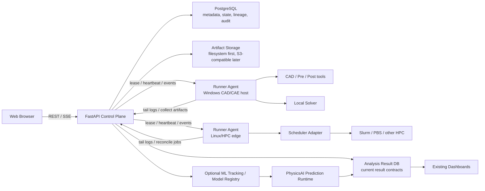

# 통합 해석 워크벤치 확장 계획

> GUI 부분 대체(2026-09-07): 1·20·21장의 1급 업무 메뉴와 화면별 정보 배치는 [의뢰 중심 작업공간 GUI](request-centric-workspace-ux.md)를 따른다. 기능별 모듈/API, 공통 monitoring projection, 권한, 작업 dependency와 `DEMO ONLY` 계약은 유지한다. 아래 기존 구현·계획 기록은 삭제하지 않는다.

- 문서 상태: DEMO_ONLY Foundation 1차 구현·운영자/관리자 UI 분리·검증 완료 · 실제 실행 정보 대기
- 문서 버전: 0.8
- 작성일: 2026-07-29
- 대상 저장소: Analysis Canvas (`React + TypeScript + FastAPI + DuckDB/PostgreSQL`)
- 구현 착수 여부: 데모 기반 Foundation 1차 범위 착수 및 검증 완료
- 실제 실행 전 메모: 실제 실행 명령·경로·로그·Scheduler·입출력 샘플은 아직 미정이며, 정보를 보강하기 전에는 어떤 실제 프로세스도 실행하지 않는다.
- 0.2 변경 사항: 좌측 탭 명칭을 `해석 의뢰 현황`으로 반영하고, `의뢰 진행 상태`를 작업 모니터링 화면으로 통합했으며 운영 대시보드와의 상태 동기화 계약을 추가했다.
- 0.3 변경 사항: 고정 순차 파이프라인 전제를 제거하고 업무를 독립 Task Type으로 정의했으며, 관리자/의뢰 정보 기반의 Request Type과 작업 조합 규칙을 추가했다.
- 0.4 변경 사항: 외부 실행이 전혀 없는 `DEMO_ONLY` Foundation을 구현했다. 13개 독립 Task Type, Request Type 불변 버전, 단독·순차·병렬 조합, 데모 이미지/이벤트, `해석 작업 실행`, `의뢰 진행 상태`와 운영 대시보드의 공통 모니터링 정본 및 역할별 권한을 반영했다.
- 0.5 변경 사항: 작업 목록은 고정 순서가 아니라는 점을 다시 명확히 하고, 의뢰 정보 규칙에 의한 Request Type 추천, 관리자·사용자의 명시적 유형 확정, 결정 출처와 불변 버전 저장, LoadCase 없는 단독 업무 의뢰의 운영 모니터링 계약을 추가했다. Foundation 전체가 아니라 현재 구현된 1차 범위와 후속 범위를 구분했다.
- 0.6 변경 사항: 이미지가 필요하지 않은 Task도 작동 과정을 시연할 수 있도록 정적 실행 로그, 검증 리포트, 결과 요약 텍스트 fixture와 화면 내 텍스트 뷰어를 추가했다. 파일은 저장소 자산이며 실제 외부 실행 결과와 명확히 구분한다.
- 0.7 변경 사항: 의뢰를 받은 수행자의 `해석 작업 실행` 화면과 관리자의 `작업 유형 관리` 화면을 분리했다. 수행자 화면은 받은 의뢰·관리자 허용 시나리오·실행 가능한 작업에 집중하며, 각 작업의 목적·필요 입력·받을 결과를 한국어로 안내한다. Request Type 작성·버전 저장은 관리자 화면에서만 수행한다.
- 0.8 변경 사항: 좌측 `의뢰 접수` 탭, 외부 시스템/부서장 지시 출처, 2개의 승인 시나리오와 불변 작업 계획, 명시적 `의뢰 수령·작업 시작`/`작업 시작`/`작업 완료` 전이, 수행·의뢰 현황·운영 대시보드의 canonical 진행률 동기화를 반영했다. PostgreSQL `0004_request_work_plans` 실제 적용과 Windows 시작 인코딩 보정까지 검증했다.

## 1. 결론과 권고안

현재 웹페이지를 단순한 결과 대시보드에서 다음 업무 능력을 선택적으로 제공하는 **통합 해석 워크벤치**로 확장할 수 있다.

```text
독립 Task Type 카탈로그
├─ CAD/형상 준비        ├─ DOE 생성              ├─ 해석 모델링
├─ HPC 제출             ├─ 실행 감시             ├─ 결과 수집
├─ 후처리               ├─ 해석 DB 발행          ├─ 학습 데이터셋 발행
├─ PhysicsAI 학습/검증  ├─ 모델 승인             ├─ 실시간 예측
└─ 대시보드 시각화
```

위 항목은 고정된 실행 순서가 아니다. 각 업무는 독립적으로 구현·버전 관리·실행할 수 있어야 하며, 의뢰 유형과 작업 정의에 따라 일부만 선택하거나 순서를 바꾸고, 병렬·분기·수동 승인 단계를 포함해 조합한다. 필요한 입력 아티팩트가 이미 등록되어 있다면 어떤 Task도 선행 Task 없이 단독 실행할 수 있어야 한다.

조합 예시는 다음과 같다.

```text
결과 재처리 의뢰: 결과 수집 → 후처리 → 해석 DB 발행
PhysicsAI 예측 의뢰: 실시간 예측 → 대시보드 시각화
DOE 해석 의뢰: DOE 생성 ─┬→ 해석 모델링 → HPC 제출
                          └→ 여러 설계점을 병렬 실행
학습 의뢰: 학습 데이터셋 발행 → PhysicsAI 학습/검증 → 모델 승인
단일 업무 의뢰: CAD/형상 준비만 또는 후처리만 실행
```

권고 구조는 **기존 FastAPI 애플리케이션을 제어면(Control Plane)으로 유지하고, 실제 CAD/CAE/HPC 명령은 실행 호스트에 설치한 별도 Runner가 수행하는 방식**이다. 초기부터 마이크로서비스로 분해하지 않고, 백엔드는 도메인별 모듈로 나눈 모듈러 모놀리스로 정리한다. Runner만 프로세스와 보안 경계를 분리한다.

핵심 결정은 다음과 같다.

1. 기존 대시보드는 유지한다. 실행 기능을 대시보드 컴포넌트 안에 넣지 않는다.
2. 기존 좌측 탭 `해석 상세`의 명칭은 **`해석 의뢰 현황`**으로 사용한다.
3. `해석 의뢰 현황`의 세부 페이지 **`의뢰 진행 상태`가 작업 모니터링 역할을 함께 담당**한다. 별도의 `작업 모니터링` 좌측 메뉴는 추가하지 않는다.
4. `해석 작업 실행`만 별도 1급 메뉴로 추가하고, 여기서 생성된 작업 상태는 `의뢰 진행 상태`에 연결한다.
5. `의뢰 진행 상태`와 `운영 대시보드`에 함께 표시되는 의뢰 값은 동일한 서버 정본과 계산 규칙을 사용하며 한쪽 변경이 다른 쪽에도 갱신되어야 한다.
6. 관리자는 Request Type과 사용 가능한 Task Type, 기본 Workflow 조합, 입력 Schema, 권한 및 승인 정책을 정의할 수 있어야 한다.
7. 의뢰의 제품·해석 목적·LoadCase·보유 입력 아티팩트 같은 의뢰 정보로 Request Type과 기본 작업 조합을 추천 또는 자동 결정할 수 있어야 한다.
8. 의뢰 수행자는 관리자가 허용한 Request Type 또는 개별 Task 중 이번 의뢰에 필요한 작업을 선택하고 실행 전 계획을 확인한다. 이 선택은 해당 실행 계획일 뿐 새 Request Type을 작성하거나 조직 카탈로그에 저장하지 않는다. Request Type 작성·버전 저장·공유는 관리자만 수행한다.
9. CAD, DOE, 모델링, HPC, 수집, 후처리, DB, ML, 예측, 시각화는 각각 독립 Task Type과 Adapter로 구현한다. 어느 구현도 고정된 전체 체인의 존재를 가정하지 않는다.
10. 사용자가 실행 경로와 로그 파일을 지정할 수 있게 하되, 관리자가 등록한 **실행 프로파일의 허용 루트와 경로 템플릿 안에서만** 선택하도록 한다.
11. UI에서 임의 셸 명령을 입력받지 않는다. 버전 관리되는 Application/Task Template과 검증된 파라미터만 실행한다.
12. Scheduler 상태, 프로세스 종료 코드, 로그 신호를 함께 수집한다. 로그의 특정 문구만으로 성공을 판정하지 않는다.
13. PostgreSQL에는 메타데이터·상태·계보를 저장하고, 대용량 원본/로그/모델/결과 파일은 파일 또는 Object Storage에 저장한다.
14. 기존 `analysis_runs`와 결과 테이블은 해석 결과의 정본으로 유지한다. 전체 작업 실행은 별도의 `workflow_runs`/`task_runs`로 관리한다.
15. 첫 실제 검증 대상으로 Radioss 작업을 선택할 수 있으나, 이는 구현 우선순위일 뿐 모든 의뢰가 거쳐야 하는 고정 경로가 아니다.

이 범위는 기능 수가 많고 CAD/솔버/HPC/라이선스 의존성이 강하다. 따라서 전체 조합을 한 번에 만들기보다 공통 Task 계약을 먼저 만든 후 개별 Task Type을 독립 승인 단위로 구현한다. 각 Task는 단독 완수조건으로 먼저 검증하며, 조합이 정의된 경우에만 별도의 통합 시나리오를 검증한다.

> 선택적 통합 검증 예: 해석 입력 선택 → Local/HPC 제출 → 실행 감시 → 결과 수집 → 해석 DB 발행 → 대시보드 연결

## 2. 현재 코드 기준 진단

### 2.1 재사용 가능한 기반

현재 저장소에는 다음 기반이 이미 있다.

- React/TypeScript 단일 웹 애플리케이션과 좌측 워크스페이스 메뉴
- 운영 대시보드, 해석 의뢰 현황(기존 `해석 상세`에서 명칭 변경), 해석 데이터, 변수 카탈로그, 자동화 템플릿, 폴더 스키마, 도움말
- Project → AnalysisRequest → LoadCase → AnalysisRun 도메인
- Scalar, Time Series, Curve, 위치, 미디어 결과 저장 구조
- 결과 폴더/CSV 가져오기, 검증, 판정, 중복 방지, Run 신뢰도와 Run 비교
- 대시보드와 보고서 레이아웃 버전 관리
- DuckDB/PostgreSQL 연결 추상화, Alembic, 사용자 역할과 감사 로그
- OpenAPI 생성 TypeScript 클라이언트 도입 기반

관련 코드와 사양은 다음에 분산되어 있다.

- `frontend/src/App.tsx`: 메뉴와 주요 워크스페이스 조합
- `backend/app/main.py`: 현재 대부분의 API 라우트
- `backend/app/repositories/`: 결과·분석·포트폴리오 저장 계층
- `backend/app/services/`: 결과 수집 검증과 판정
- `backend/migrations/schema.sql`: 현재 데이터 모델
- `docs/result-import-pipeline-spec.md`: 결과 수집 계약
- `docs/stabilization-and-portability-spec.md`: DB·인증·이식성 원칙

### 2.2 새 범위와의 차이

현재의 `자동화 템플릿`은 실행 이력 조회 성격이 강하며, 실제 프로세스 실행·작업 임대·HPC 제출·취소·재시도·로그 tail·상태 조정 기능은 없다. 또한 다음 도메인이 아직 분리되어 있지 않다.

- 실행 가능한 워크플로 정의와 불변 버전
- 독립 Task Type 카탈로그와 Task별 상태 머신
- Request Type, 의뢰 정보 기반 유형 결정 규칙, 관리자 정의 작업 조합
- 선택·병렬·분기·조건·수동 승인을 표현하는 Workflow Definition
- 실행 호스트 Runner 등록과 heartbeat
- Local/Slurm/PBS 등의 실행 어댑터
- 작업별 실행 디렉터리·로그 소스·결과 패턴 설정
- CAD/DOE/전처리/솔버/후처리 Application Template
- 아티팩트 계보와 데이터셋/모델 수명주기
- PhysicsAI 학습, 모델 승인, 예측 서비스

그리고 `App.tsx`와 `main.py`가 각각 매우 큰 단일 파일이므로, 새 기능을 그대로 추가하면 상태 결합과 회귀 위험이 급격히 커진다. 기능 구현 전에 라우트·서비스·화면을 도메인 모듈로 이동할 경계를 먼저 만들어야 한다.

## 3. 제품 목표, 비목표, 성공 지표

### 3.1 제품 목표

사용자는 한 웹페이지에서 다음 기능을 각각 또는 조합하여 수행하고, 실행한 Task의 입력·실행자·도구 버전·출력·판정을 추적할 수 있어야 한다. 아래 번호는 실행 순서를 의미하지 않는다.

1. CAD 또는 기준 형상을 선택하고 파라메트릭 변형을 생성한다.
2. DOE 방법과 설계변수를 정의해 해석 점을 생성한다.
3. 해석 모델링 템플릿으로 Solver Deck을 만든다.
4. Local 또는 HPC 실행 프로파일로 작업을 제출한다.
5. Scheduler 상태와 로그를 거의 실시간으로 확인한다.
6. 결과를 수집하고 검증된 후처리를 실행한다.
7. 해석 DB에 결과와 계보를 발행한다.
8. 승인된 결과만 학습 데이터셋 버전에 포함한다.
9. PhysicsAI 학습·시험을 실행하고 모델을 승인한다.
10. 승인된 모델로 실시간 또는 비동기 예측을 수행한다.
11. 현재 대시보드가 해석 DB와 예측 결과를 함께 시각화한다.
12. 관리자가 Request Type과 허용 Task Type/기본 Workflow를 정의한다.
13. 의뢰 정보로 적합한 Request Type과 작업 조합을 결정하거나 추천한다.

각 기능의 독립성 조건은 다음과 같다.

- Task는 입력·출력 아티팩트 계약으로만 연결하고 다른 Task 구현을 직접 호출하지 않는다.
- 필요한 입력을 사용자가 등록하거나 기존 자산에서 선택할 수 있으면 Task를 단독 실행할 수 있다.
- 조합은 Workflow Definition의 노드와 dependency edge로 표현하며 전역 고정 순서를 두지 않는다.
- Task Type과 Workflow Definition은 별도로 버전 관리한다.

### 3.2 비목표

초기 범위에서는 다음을 구현하지 않는다.

- 브라우저 안에서 범용 CAD GUI 전체를 재구현
- 모든 CAD/CAE/HPC 제품을 동시에 지원
- UI에서 임의 Python, Tcl, PowerShell, Bash 명령을 입력해 실행
- 원본 CAE 대용량 바이너리를 PostgreSQL BLOB으로 저장
- 로그 텍스트만으로 Solver 성공/실패를 확정
- 검증되지 않은 PhysicsAI 모델의 자동 운영 배포
- 첫 단계부터 Kubernetes/Temporal/Argo 같은 별도 오케스트레이터 도입

CAD 작업은 두 수준으로 구분한다.

- **1차: Headless CAD/형상 자동화** — 승인된 스크립트나 CAD API를 파라미터로 실행한다.
- **후속: Interactive CAD 세션** — 필요할 경우 원격 데스크톱/애플리케이션 스트리밍으로 제공한다. 이는 라이선스, GPU 세션, 파일 잠금, 동시 사용자 제어가 필요한 별도 프로젝트다.

### 3.3 운영 성공 지표

- 제출된 작업의 100%가 `누가/무엇을/어느 버전으로/어디서` 실행했는지 추적된다.
- 완료된 해석 Run의 입력과 주요 출력에 SHA-256 체크섬이 있다.
- Runner 또는 웹 서버 재시작 후 진행 중 작업 상태가 복구·재조정된다.
- 작업 로그는 재접속 시 마지막 offset부터 이어서 조회된다.
- 결과 DB 발행과 학습 데이터셋 발행은 중복 실행해도 중복 데이터를 만들지 않는다.
- 승인되지 않은 템플릿, 허용 루트 밖 경로, 임의 명령은 실행되지 않는다.
- 기존 대시보드와 결과 가져오기 회귀 테스트가 계속 통과한다.

## 4. 권고 정보 구조와 화면

기존 대시보드는 그대로 두고 좌측 메뉴를 다음처럼 확장한다.

| 메뉴 | 목적 | 주요 화면 |
|---|---|---|
| 운영 대시보드 | 기존 포트폴리오 현황 | 기존 유지 |
| **해석 의뢰 현황** | 의뢰 진행 및 연결 작업 모니터링, 기존 결과 분석 | `의뢰 진행 상태`, 상세 분석, Run 비교·검토 |
| **해석 작업 실행** | 새 Workflow Run 생성 | 템플릿 선택, 파라미터, DOE, 실행 프로파일, 사전 점검, 제출 |
| **작업 유형 관리** *(Admin 전용)* | 수행자에게 제공할 유형과 허용 작업 정의 | Request Type 작성, Task 선택, 기본 조합, 불변 버전 저장 |
| 해석 데이터 | 결과 수집·DB 발행 | 기존 기능 확장 |
| **데이터·모델 자산** | CAD/Deck/결과/데이터셋/모델 계보 | 버전, 체크섬, 입력·출력 관계, 승인 상태 |
| **PhysicsAI** | 데이터셋·학습·시험·예측 | 학습 실행, 지표, 모델 레지스트리, 예측 |
| 변수 카탈로그 | 결과 변수 계약 | 기존 유지 |
| 자동화 템플릿 | 독립 Task Type과 조합 가능한 Workflow Template | Task 카탈로그, Workflow 조합 편집기, 버전 |
| 폴더 스키마 | 결과 수집 규칙 | 기존 유지 |
| **설정** | 의뢰/작업 유형, 실행 환경과 정책 | Request Type, 허용 Task, 기본 Workflow, Runner, 실행 프로파일, Scheduler, 로그 파서, 저장소, 보존 정책 |

### 4.1 해석 작업 실행

제출 흐름은 Wizard 형태가 적합하다.

1. Project / AnalysisRequest / LoadCase 또는 새 작업 문맥 선택
2. 의뢰 정보로 결정된 Request Type을 확인하거나 관리자가 허용한 유형에서 선택
3. 단일 Task Type 또는 Workflow Template의 고정 버전 선택
4. 선택된 Task 노드, dependency, 병렬·분기·선택 조건을 확인하고 이번 실행에 필요한 작업만 선택
5. 각 Task가 요구하는 입력 CAD/Deck/이전 Run/결과/데이터셋 선택
6. Task별 실행 프로파일, 작업 경로, 로그 프로파일과 리소스 요청 설정
7. 사전 점검
   - 입력 파일과 체크섬
   - 실행 도구·라이선스 가용성
   - 경로 쓰기 권한과 여유 공간
   - Scheduler/Runner 연결
   - 파라미터 JSON Schema 검증
8. 실행 계획 미리보기와 승인
9. 제출

제출 뒤에는 입력이나 템플릿 버전을 수정하지 않는다. 수정이 필요하면 새 Workflow Run을 만든다.

#### 4.1.1 Request Type과 사용자 작업 유형 정의

관리자는 수행자 화면과 분리된 `작업 유형 관리` 화면에서 사용자가 선택할 수 있는 의뢰 유형과 작업 유형을 정의한다. 일반 수행자에게는 이 작성 화면과 저장 기능을 노출하지 않는다.

유형 정의는 두 층으로 나눈다.

- **공유 Request Type**: 관리자가 조직 공통 유형, 노출 대상, 허용 Task, 기본 DAG, 매칭 규칙을 불변 버전으로 정의한다.
- **의뢰 실행 계획**: 수행자가 해당 의뢰에 허용된 Task 중 필요한 작업을 단독·병렬·dependency 조합으로 선택한다. 이는 Run 생성 입력으로만 저장하며 Request Type 카탈로그를 생성·수정하지 않는다. 재사용 가능한 유형이 필요하면 관리자가 별도 Request Type 불변 버전을 작성한다.

수행자용 `해석 작업 실행` 화면은 다음 세 단계로 단순화한다.

1. 받은 의뢰 선택 및 프로젝트·분석 유형·현재 단계 확인
2. 관리자 지정 또는 허용된 실행 시나리오 확인
3. 작업별 `하는 일`, `필요 입력`, `받을 결과`를 비교하고 실행할 작업 선택

관리자용 `작업 유형 관리` 화면은 유형 ID·표시명·설명·자동 추천 규칙·기본 실행 방식·허용 Task를 편집하고 새 불변 버전을 저장한다. 두 화면은 URL/워크스페이스 상태와 권한을 분리하며 Viewer에게 관리자 메뉴를 표시하지 않는다.

의뢰 정보는 유형 자체를 임의 생성하는 실행 코드가 아니라, 관리자가 버전 관리한 Request Type 중 적합한 후보를 추천·결정하는 입력이다. 규칙 결과가 하나면 추천하고, 둘 이상이면 `REVIEW_REQUIRED`, 일치 항목이 없으면 `USER_SELECTION`으로 두어 사람의 선택 없이 자동 실행하지 않는다.

Request Type 정의 항목:

- ID, 표시명, 설명, 활성 상태, 버전
- 사용자/그룹/역할별 노출 및 실행 권한
- 의뢰 정보 매칭 규칙: 제품, 해석 목적, 분석 유형, LoadCase, 입력 아티팩트 종류, 태그
- 허용 Task Type 목록
- 기본 Workflow Definition과 버전
- 필수/선택 입력 Schema와 기본 파라미터
- Task 추가·제거·재배열 허용 범위
- 예상 비용, 리소스 제한, 승인 정책

Task Type 정의 항목:

- Task Kind, 표시명, 설명, 버전, 활성 상태
- 단독 실행 지원 여부
- 입력/출력 Artifact Type 계약
- 파라미터 JSON Schema
- 사용할 Adapter와 허용 Execution Profile
- timeout, retry, 로그/결과 수집 정책
- 사용자/그룹/역할별 실행 권한

의뢰의 최종 작업 유형 결정 우선순위는 다음과 같다.

1. 관리자가 해당 의뢰에 명시적으로 지정한 Request Type
2. 의뢰 정보 매칭 규칙으로 결정된 Request Type
3. 사용자에게 허용된 유형 중 사용자가 선택한 Request Type 또는 단일 Task Type
4. 시스템 기본 Request Type

자동 결정 결과에는 적용한 규칙과 Request Type Version을 표시한다. 관리자가 유형 정의를 변경해도 이미 생성된 의뢰와 실행 계획은 당시 버전을 유지한다. 자동 결정이 모호하거나 여러 규칙이 같은 우선순위로 일치하면 자동 실행하지 않고 사용자 또는 관리자 선택을 요구한다.

확정 레코드는 `request_id`, `request_type_id`, `request_type_version`, 결정 출처(`ADMIN`, `RULE`, `USER`, `DEFAULT`), 적용 규칙 snapshot, 결정자, 결정 시각을 보관한다. 관리자 지정은 일반 사용자가 덮어쓸 수 없다. `의뢰 진행 상태`와 운영 대시보드는 이 레코드를 동일한 모니터링 projection으로 조회한다.

### 4.2 해석 의뢰 현황 > 의뢰 진행 상태

`의뢰 진행 상태`는 기존 의뢰 단계 현황과 향후 실행 작업 모니터링을 한 문맥에서 보여주는 기준 화면이다. 별도의 `작업 모니터링` 워크스페이스를 만들지 않는다. 실행 기능이 추가되면 의뢰 카드에서 연결된 Workflow Run과 Task Run 상세를 열도록 확장한다.

- 의뢰 목록/카드: 의뢰 상태, 현재 단계, 전체 진행률, 담당자, 프로젝트, 요청일, 예정일, 차단 사유, 최근 변경 시각
- 연결 작업 요약: 실행 상태, Solver, 실행 위치, Scheduler Job ID, 경과시간, 최근 로그 시각
- 작업 상세: Workflow DAG, Task 상태, 현재 로그, 경고/오류 이벤트, 리소스 사용량, 입출력 아티팩트, 재시도 이력
- 조치: 취소 요청, 실패 Task 재시도, 동일 입력으로 재실행, 결과 수집 재시도, 관리자 강제 상태 조정
- 필터: 내 작업, 프로젝트, Solver, Runner/HPC, 상태, 기간, 실패 코드

강제 상태 조정은 원 상태를 덮어쓰지 않고 감사 이벤트를 추가해야 한다.

연결 작업 요약부터 실행 관련 상세 필드까지는 실제 실행 정보가 확정된 뒤 추가한다. 그 전까지는 현재 `analysis_requests`와 `request_steps` 기반의 의뢰 단계 상태를 기준으로 동작한다.

#### 4.2.1 운영 대시보드와 의뢰 상태 동기화 계약

`의뢰 진행 상태`와 `운영 대시보드`는 서로 복사한 별도 상태를 저장하지 않는다. 두 화면은 같은 의뢰 상태 정본과 동일한 계산 서비스를 사용해야 한다.

공유 대상은 최소 다음과 같다.

- 의뢰 ID, 제목, 프로젝트, 제품, 담당자
- Request Type ID·표시명·버전과 결정 출처
- 의뢰 상태와 현재 단계
- 단계별 상태·담당자·진행률·선택 단계 여부·메모
- 전체 진행률
- 요청일, 예정일, 최근 변경 시각
- 차단/실패 여부와 사유
- 연결된 LoadCase와 최신 결과 상태
- 향후 추가할 연결 Workflow Run/Task Run 요약

동기화 규칙은 다음과 같다.

1. `analysis_requests`, `request_steps`와 향후 연결할 실행 상태를 서버 정본으로 사용한다.
2. 의뢰 전체 진행률과 현재 단계는 하나의 `RequestMonitoringService` 계산 규칙으로 산출한다.
3. `GET /api/workflows`, `GET /api/requests/{request_id}/workflow`, `GET /api/portfolio/overview`는 같은 의뢰 모니터링 projection을 사용한다.
4. `의뢰 진행 상태`에서 단계 변경을 저장하면 하나의 트랜잭션으로 단계와 파생 의뢰 상태를 확정한다.
5. 저장 성공 직후 두 화면의 관련 query를 무효화해 다시 읽는다. 실시간 이벤트가 도입되면 동일한 의뢰 변경 이벤트로 두 화면을 갱신한다.
6. 운영 대시보드에는 별도의 수동 편집 값이나 브라우저 `localStorage` 복사본을 두지 않는다.
7. 두 화면에 같은 필드가 표시될 경우 값, 단위, 상태명, 계산 시각이 일치해야 한다.
8. 네트워크 지연 중에는 마지막 갱신 시각을 표시하고, 저장되지 않은 편집 값은 운영 대시보드에 선반영하지 않는다.

수용 기준:

- `의뢰 진행 상태`에서 단계 상태·담당자·진행률을 저장하면 운영 대시보드의 동일 의뢰 값이 갱신된다.
- 운영 대시보드에서 의뢰를 열면 같은 의뢰 ID의 `의뢰 진행 상태`로 이동한다.
- 두 화면을 동시에 열어도 저장 완료 후 동일한 전체 진행률과 현재 단계를 표시한다.
- 새로고침, 로그아웃/로그인, 다른 브라우저 접속 후에도 값이 동일하다.
- 저장 실패나 편집 취소 시 어느 화면의 서버 값도 변경되지 않는다.
- 향후 실행 상태를 추가할 때도 기존 의뢰 값의 정본과 계산 규칙을 분리하거나 중복 저장하지 않는다.

### 4.3 PhysicsAI

PhysicsAI 화면은 다음 네 영역으로 나눈다.

1. Dataset Registry: 포함 Run, 제외 사유, 데이터 품질, 분할 방식, Dataset Version
2. Training Runs: 설정, 입력/출력 변수, 방법, 리소스, 로그, loss, 산출 모델
3. Model Registry: 모델 버전, 학습 데이터 계보, 평가 지표, 승인 단계
4. Prediction: 승인 모델, 입력 형상, 유사도/적용 범위, 예측 결과, 실제 해석과 비교

`실시간 예측`은 요청-응답 지연 목표를 만족하는 모델만 동기 API로 제공하고, 대형 형상이나 긴 전처리가 필요한 경우 비동기 Prediction Run으로 처리한다.

## 5. 목표 아키텍처



### 5.1 제어면

FastAPI 제어면의 책임은 다음으로 제한한다.

- Workflow/Task 정의와 버전 관리
- 파라미터 검증과 실행 계획 생성
- 작업 Queue/Lease와 상태 전이
- Runner/Scheduler 상태 조정
- 이벤트·로그 조회 API와 SSE 스트림
- 아티팩트 메타데이터와 계보
- 결과 DB 발행과 ML 수명주기 승인
- 인증, 권한, 감사

제어면은 CAD/솔버 실행 파일을 직접 시작하지 않는다.

### 5.2 Runner Agent

Runner는 실행 호스트 또는 HPC 접점에 설치하는 Python 서비스다.

- 제어면으로 outbound 연결하고 작업을 lease한다.
- 등록된 실행 프로파일과 Task Template만 해석한다.
- 프로세스 그룹을 생성하고 PID/Job ID를 기록한다.
- 로그 파일의 offset과 파일 identity를 checkpoint한다.
- heartbeat, 진행 이벤트, 종료 코드, 아티팩트 manifest를 전송한다.
- Scheduler와 제어면 상태를 주기적으로 reconcile한다.
- 취소 요청을 실제 프로세스 또는 Scheduler 취소로 변환한다.
- 네트워크 단절 시 로컬 spool에 이벤트를 보존하고 재전송한다.

HPC 내부에 inbound 포트를 열기보다 Runner가 제어면으로 나가는 연결을 기본으로 한다.

### 5.3 저장소 분리

| 저장 대상 | 기본 저장소 | 이유 |
|---|---|---|
| Workflow/Task 상태, 설정 버전, 승인, 계보 | PostgreSQL | 트랜잭션, 동시성, 조회 |
| 원본 CAD/Deck, Solver 결과, 전체 로그, 모델 파일 | 파일 저장소 또는 S3 호환 저장소 | 대용량, 수명주기, 스트리밍 |
| Scalar/시계열/Curve/미디어 메타데이터 | 현재 해석 DB 계약 | 기존 대시보드 재사용 |
| 검색용 로그 이벤트와 진행률 | PostgreSQL | 빠른 필터와 UI 표시 |
| 전체 원문 로그 | 아티팩트 저장소 | DB 팽창 방지 |
| ML 실험 지표와 모델 계보 | 자체 테이블 또는 MLflow Adapter | 제품 종속성 격리 |

운영 실행 Queue에는 PostgreSQL을 사용한다. DuckDB는 개발·데모·읽기 전용 분석 모드로 남길 수 있지만, 여러 Runner가 동시에 lease하고 상태를 갱신하는 운영 제어면에는 적합하지 않다.

## 6. 실행 프로파일과 경로 설정

사용자가 요청한 작업별 실행 경로와 로그 파일 설정은 세 가지 객체로 나눈다.

1. **Execution Profile**: 어디서, 어떤 OS/Runner/Scheduler로 실행하는가
2. **Application Template**: 어떤 승인된 실행 파일과 파라미터를 사용하는가
3. **Log Parser Profile**: 어떤 로그를 읽고 상태·진행률·오류를 어떻게 해석하는가

개념 예시는 다음과 같다.

```yaml
execution_profile:
  id: win-radioss-local-v1
  runner_pool: windows-cae
  execution_mode: local
  work_root_alias: cae_stage
  workdir_template: "{project_id}/{workflow_run_id}/{task_key}"
  artifact_store: shared-cae-results
  environment_secret_refs:
    - altair_license_server
  allowed_application_templates:
    - radioss-solver-v2025

application_template:
  id: radioss-solver-v2025
  version: 3
  adapter: process
  executable_alias: radioss_2025
  argument_schema: radioss-submit.schema.json
  argv_template:
    - "{input_deck}"
    - "-np"
    - "{cpu_count}"
  timeout_seconds: 86400

log_parser_profile:
  id: radioss-engine-log-v1
  sources:
    - relative_glob: "*.out"
      encoding: utf-8
      parser: radioss_engine
      required: true
    - relative_glob: "stderr.log"
      encoding: utf-8
      parser: generic_text
      required: false
```

### 6.1 경로 보안 규칙

- DB에는 물리 절대경로보다 `storage_location_id + relative_path`를 우선 저장한다.
- 관리자가 Runner별 `work_root_alias`의 실제 경로를 등록한다.
- 최종 경로는 Runner가 resolve하고 허용 루트 하위인지 다시 검사한다.
- `..`, 장치 경로, UNC 임의 호스트, symlink/junction 탈출을 차단한다.
- 입력과 출력 디렉터리를 구분하고 원본 입력은 기본 읽기 전용으로 stage한다.
- Workflow Run ID를 작업 디렉터리에 포함해 충돌과 덮어쓰기를 방지한다.
- 실행 전 예상 출력과 기존 파일 충돌 정책을 표시한다.
- 사용자 입력으로 실행 파일 위치, 셸 문자열, 환경변수 이름을 직접 받지 않는다.

## 7. Workflow와 Task 모델

모든 업무를 버전된 독립 Task Type으로 표현한다. Workflow는 필요한 Task Type을 선택해 연결한 실행 조합일 뿐이며, 시스템 전체에 적용되는 고정 파이프라인은 없다.

독립 구현 원칙:

- 각 Task Type은 자체 입력 Schema, 출력 Artifact Type, 실행 Adapter, 상태·완료 정책, 테스트를 가진다.
- Task 구현은 다른 Task의 서비스나 내부 테이블을 직접 호출하지 않는다.
- Task 간 전달은 버전과 checksum이 있는 Artifact 또는 명시적 parameter reference로만 수행한다.
- 선행 Task가 없어도 요구 입력 아티팩트가 등록되어 있으면 단독 실행할 수 있다.
- 한 Task Type을 구현·배포·비활성화해도 다른 Task Type의 실행 계약이 깨지지 않아야 한다.
- Workflow Definition은 Task Type Version을 고정해 참조한다.

### 7.1 표준 Task 종류

| Task Kind | 예 | 대표 출력 |
|---|---|---|
| `CAD_PREPARE` | CAD 파라미터 적용, 형상 변형 | STEP/Parasolid/native CAD |
| `DOE_GENERATE` | DOE point 생성 | DOE matrix, point manifest |
| `MODEL_BUILD` | Meshing, property/load/BC 적용 | Solver deck |
| `HPC_SUBMIT` | Solver/학습/범용 작업을 Local 또는 HPC에 제출 | Scheduler Job ID, submission manifest |
| `EXECUTION_MONITOR` | 시스템 외부에서 시작된 작업 또는 Scheduler Job 감시 | normalized events, final status |
| `RESULT_COLLECT` | 결과 파일 발견·stage | artifact manifest |
| `POSTPROCESS` | KPI/curve/contour 생성 | CSV/JSON/H3D/image |
| `ANALYSIS_DB_PUBLISH` | 검증 결과 DB 적재 | AnalysisRun, result rows |
| `ML_DATASET_BUILD` | 승인 Run 선별·변환 | immutable dataset version |
| `PHYSICSAI_TRAIN` | PhysicsAI batch 학습 | model, log, metrics |
| `PHYSICSAI_TEST` | holdout 평가 | score report |
| `MODEL_APPROVE` | 검토·승인과 운영 별칭 변경 | approved model version |
| `PHYSICSAI_PREDICT` | 신규 형상 예측 | predicted field/KPI/curve |
| `DASHBOARD_VISUALIZE` | 등록 결과 또는 예측을 대시보드 view에 연결 | dashboard binding/version |

`EXECUTION_MONITOR`는 외부에서 이미 제출된 Job을 감시할 때 독립 Task로 사용할 수 있다. 시스템이 직접 시작한 실행 Task에는 동일한 모니터링 기능을 공통 기능으로 자동 부착할 수도 있으며, 이 경우 별도 선후행 Task를 강제하지 않는다.

관리자는 기본 Task Kind를 기반으로 조직별 Custom Task Type을 추가할 수 있다. Custom Type도 동일한 입력·출력·보안·버전 계약을 따라야 한다.

### 7.2 Workflow 조합 규칙

Workflow Definition은 다음을 표현할 수 있어야 한다.

- 단일 Task만 포함한 Workflow
- 순차 dependency: A 성공 후 B 실행
- 병렬 실행: A와 B를 동시에 실행
- fan-out/fan-in: DOE point별 병렬 실행 후 결과 집계
- 조건 분기: 의뢰 파라미터, 앞 Task 결과, 판정에 따른 분기
- 선택 Task: 사용자가 실행 계획에서 포함 여부 선택
- 수동 Task/Gate: 검토·승인 후 다음 Task 허용
- 실패 정책: 전체 중단, 독립 분기 계속, 부분 성공 허용

Dependency edge에는 최소 `source_node`, `target_node`, `condition`, `required_status`를 둔다. Task 노드의 화면 순서는 실행 순서와 동일하다고 가정하지 않는다.

Request Type은 하나 이상의 허용 Workflow Definition 또는 단일 Task Type을 가리킨다. 같은 Task Type이 여러 Request Type과 Workflow에서 재사용되어야 한다.

### 7.3 상태 머신

```text
DRAFT → VALIDATING → READY → QUEUED → LEASED → STARTING
→ RUNNING → COLLECTING → SUCCEEDED
                    └→ FAILED
QUEUED/RUNNING → CANCEL_REQUESTED → CANCELLED
LEASED/RUNNING → LOST → RECONCILING → RUNNING | FAILED | CANCELLED
```

상태 전이는 API 서비스 한 곳에서 검증한다. Runner 이벤트가 DB 상태를 임의로 덮어쓰지 않으며, 동일 이벤트 재전송은 idempotency key로 무시한다.

Task 완료 조건은 Task Type의 completion policy가 정한다. 실행형 Task의 기본 성공 조건은 다음 순서로 판정한다.

1. Scheduler/프로세스가 종료 상태인가
2. 종료 코드가 Application Template 정책과 일치하는가
3. 필수 로그와 필수 출력 아티팩트가 존재하는가
4. 로그 파서가 fatal event를 검출했는가
5. 결과 검증기가 산출물 구조와 체크섬을 승인했는가

진행률은 로그에서 추출할 수 있으나, 성공의 단독 근거로 사용하지 않는다.

- 수동 승인 Task는 승인 주체, 결정, 시각, 근거가 기록되어야 완료된다.
- DB 발행 Task는 대상 transaction commit과 idempotency key가 확인되어야 완료된다.
- 시각화 Task는 저장된 dashboard binding/version을 출력으로 남겨야 완료된다.
- 해당 조건이 필요 없는 Task에는 Scheduler, 로그 또는 결과 파일 조건을 강제하지 않는다.

## 8. 로그 기반 모니터링 설계

### 8.1 수집 흐름

1. Runner가 지정된 relative glob으로 로그 파일 생성을 감시한다.
2. 파일 ID, 크기, 수정 시각, byte offset을 저장한다.
3. 새 구간을 읽어 parser plugin에 전달한다.
4. 원문 chunk는 압축 가능한 아티팩트로 저장한다.
5. parser는 정규화된 이벤트와 진행률을 생성한다.
6. Runner가 batch로 제어면에 전송한다.
7. 브라우저는 SSE로 새 이벤트를 받고, 재접속 시 마지막 event sequence부터 이어받는다.

정규화 이벤트 예시는 다음과 같다.

```json
{
  "event_id": "evt-...",
  "workflow_run_id": "wfr-...",
  "task_run_id": "tsr-...",
  "source": "radioss-engine-log",
  "source_timestamp": "2026-07-28T10:15:11Z",
  "observed_at": "2026-07-28T10:15:12Z",
  "severity": "INFO",
  "event_type": "SOLVER_CYCLE_PROGRESS",
  "progress": 42.5,
  "message": "cycle 42500",
  "attributes": {
    "cycle": 42500,
    "estimated_total": 100000,
    "runner_id": "runner-win-01"
  }
}
```

### 8.2 필수 예외 처리

- 로그가 늦게 생성되는 작업
- 여러 파일로 분할되는 로그
- rotation/truncate 후 같은 파일명 재사용
- UTF-8이 아닌 Solver 로그 인코딩
- 한 줄이 매우 큰 로그
- 로그는 멈췄지만 Solver는 실행 중인 상태
- Solver는 끝났지만 Scheduler 상태 반영이 늦는 상태
- 네트워크 단절과 중복 event 전송
- Runner 재시작 후 offset 복구
- Cancel 요청과 자연 종료가 경쟁하는 상태

작업의 `최근 로그 시각`과 Runner heartbeat를 별도로 보여주어 “무출력 정상 계산”과 “실행 유실”을 구분한다.

## 9. 어댑터 계약

제품별 코드는 공통 서비스에 직접 넣지 않고 아래 포트 뒤에 둔다.

각 Adapter는 하나의 Task Type 기능에 집중한다. Workflow orchestration은 Adapter 내부가 아니라 제어면의 Workflow 서비스가 담당한다.

```python
class TaskExecutor:
    def preflight(self, spec): ...
    def start(self, spec): ...
    def poll(self, external_id): ...
    def cancel(self, external_id): ...

class SchedulerAdapter:
    def submit(self, job_spec): ...
    def status(self, scheduler_job_id): ...
    def cancel(self, scheduler_job_id): ...
    def usage(self, scheduler_job_id): ...

class LogParser:
    def parse(self, chunk, context): ...

class ArtifactCollector:
    def discover(self, task_dir, rules): ...
    def validate(self, artifacts): ...

class ResultPublisher:
    def validate(self, manifest): ...
    def publish(self, manifest, analysis_run_id): ...

class ModelRuntime:
    def train(self, dataset, spec): ...
    def test(self, model, dataset): ...
    def predict(self, model, input_artifact): ...
```

모든 Task Adapter는 공통적으로 `validate_inputs`, `describe_outputs`, `preflight` 계약을 제공해야 한다. 이를 통해 단독 실행과 조합 실행이 같은 검증 경로를 사용한다.

초기 어댑터 우선순위는 다음과 같다.

1. `MockExecutor`와 `GenericProcessExecutor`
2. Radioss Application/Log/Result Adapter
3. 실제 사용 중인 Scheduler 하나: Slurm 또는 PBS
4. 실제 CAD/전처리 도구 하나
5. DOE: 우선 HyperStudy batch 또는 내부 DOE generator 중 하나
6. PhysicsAI batch Adapter

## 10. 데이터 모델 확장안

### 10.1 기존 모델과 연결

기존 엔터티는 유지한다.

```text
Project → AnalysisRequest → LoadCase → AnalysisRun → Results / Media / Validation
```

Request Type과 새 실행 계보를 옆에 둔다.

```text
RequestType → RequestTypeVersion ──→ allowed TaskTypeVersion
                     │
                     └─────────────→ default WorkflowVersion
                                           │
AnalysisRequest → RequestTypeAssignment ───┴→ WorkflowRun → TaskRun
                                                            ├─ SchedulerJob
                                                            ├─ TaskEvent / LogSource
                                                            └─ ArtifactLink → AnalysisRun 등

TaskType → TaskTypeVersion ──→ WorkflowVersion의 Task Node
WorkflowVersion: Task Node + Dependency Edge + Condition + Failure Policy
```

`analysis_runs`를 전체 작업 조합의 상태 테이블로 재사용하지 않는다. Solver Run 결과와 CAD/DOE/학습 Task의 수명주기는 서로 다르기 때문이다.

### 10.2 신규 테이블 그룹

#### 실행 정의

- `request_types`
- `request_type_versions`
- `request_type_match_rules`
- `request_type_allowed_tasks`
- `request_type_workflow_bindings`
- `analysis_request_type_assignments`
- `task_type_definitions`
- `task_type_versions`
- `workflow_definitions`
- `workflow_definition_versions`
- `workflow_task_nodes`
- `workflow_task_edges`
- `task_template_definitions`
- `task_template_versions`
- `execution_profiles`
- `execution_profile_versions`
- `log_parser_profiles`
- `log_parser_profile_versions`

#### 실행 상태

- `workflow_runs`
- `task_runs`
- `task_run_dependencies`
- `task_run_attempts`
- `runner_agents`
- `runner_leases`
- `scheduler_jobs`
- `task_events`
- `task_log_sources`
- `task_log_cursors`

#### 아티팩트와 계보

- `storage_locations`
- `artifacts`
- `artifact_versions`
- `artifact_links`
- `lineage_edges`

#### DOE

- `doe_studies`
- `doe_study_versions`
- `doe_variables`
- `doe_points`
- `doe_point_runs`

#### ML/PhysicsAI

- `ml_datasets`
- `ml_dataset_versions`
- `ml_dataset_items`
- `training_runs`
- `model_versions`
- `model_evaluations`
- `model_approvals`
- `prediction_runs`

### 10.3 불변성과 재현성

- AnalysisRequest는 결정된 Request Type Version과 결정 출처(`ADMIN`, `RULE`, `USER`, `DEFAULT`)를 보관한다.
- Request Type 매칭 규칙과 허용 작업 변경은 새 버전을 만들며 기존 의뢰의 유형을 암묵적으로 바꾸지 않는다.
- Workflow Version은 Task Type Version, node parameter mapping, dependency edge, 조건과 실패 정책을 고정한다.
- Definition, Template, Execution Profile, Dataset은 실행 시점 버전을 고정한다.
- Run은 템플릿 버전, 실행 프로파일 버전, 입력 아티팩트 버전을 참조한다.
- 아티팩트는 `size`, `sha256`, `media_type`, `producer_task_run_id`를 가진다.
- ML Dataset Version은 포함한 AnalysisRun과 결과 변수 목록을 불변 snapshot으로 보관한다.
- Model Version은 Dataset Version, 학습 설정, PhysicsAI 버전, 라이선스/실행 환경, 평가를 참조한다.
- 승인된 Model Version만 `production` 또는 업무별 별칭을 받을 수 있다.

## 11. API 초안

### 의뢰 현황 공유 계약

다음 기존 API는 유지하되, 내부적으로 같은 `RequestMonitoringSummary` read model을 사용한다.

```text
GET             /api/workflows
GET             /api/requests/{request_id}/workflow
PUT             /api/requests/{request_id}/workflow-steps
GET             /api/portfolio/overview
```

`운영 대시보드`와 `해석 의뢰 현황 > 의뢰 진행 상태`가 각각 별도의 의뢰 상태 계산을 갖지 않도록 한다. 향후 Workflow Run/Task Run 실행 요약을 추가할 때도 이 read model을 확장하고 기존 의뢰 식별자와 상태 계약을 유지한다.

### 정의와 설정

```text
GET/POST        /api/request-types
GET/POST        /api/request-types/{id}/versions
POST            /api/request-types/resolve
PUT             /api/requests/{request_id}/request-type
GET/POST        /api/task-types
GET/POST        /api/task-types/{id}/versions
GET/POST        /api/workflow-definitions
GET/POST        /api/workflow-definitions/{id}/versions
GET/POST        /api/task-templates
GET/POST        /api/execution-profiles
POST            /api/execution-profiles/{id}/preflight
GET/POST        /api/log-parser-profiles
GET/POST        /api/runner-agents
GET             /api/scheduler-connections/{id}/health
```

`POST /api/request-types/resolve`는 저장 전 미리보기 API다. 의뢰 정보와 일치한 규칙, 추천 Request Type Version, 허용 Task/Workflow, 모호성 여부를 반환하며 사용자가 확정하기 전 실행을 만들지 않는다.

### 실행

```text
POST            /api/workflow-runs/plan
POST            /api/workflow-runs
POST            /api/task-runs/plan                 # 독립 Task 실행 계획
POST            /api/task-runs                      # 독립 Task 실행
GET             /api/workflow-runs
GET             /api/workflow-runs/{id}
POST            /api/workflow-runs/{id}/cancel
POST            /api/task-runs/{id}/retry
GET             /api/task-runs/{id}/events
GET             /api/task-runs/{id}/logs
GET             /api/task-runs/{id}/stream          # SSE
GET             /api/task-runs/{id}/artifacts
```

### Runner 내부 API

```text
POST            /api/runner/heartbeat
POST            /api/runner/tasks/lease
POST            /api/runner/tasks/{id}/start
POST            /api/runner/tasks/{id}/events:batch
POST            /api/runner/tasks/{id}/complete
POST            /api/runner/tasks/{id}/reconcile
```

Runner API는 사용자 API와 인증 체계를 분리하고 짧은 수명의 machine credential과 Runner identity를 사용한다.

### 데이터와 모델

```text
POST            /api/artifacts/register
GET             /api/artifacts/{id}/lineage
POST            /api/analysis-runs/{id}/publish
POST            /api/ml-datasets/plan
POST            /api/ml-datasets
POST            /api/training-runs
POST            /api/model-versions/{id}/evaluate
POST            /api/model-versions/{id}/approve
POST            /api/predictions
GET             /api/predictions/{id}
```

OpenAPI를 단일 원본으로 유지하고 변경 시 `frontend/src/shared/api/generated`를 재생성한다.

## 12. 권고 코드 뼈대

현재 파일을 한 번에 재작성하지 않고 신규 기능부터 아래 구조를 따른다. 기존 라우트는 수정하는 시점에 점진적으로 이동한다.

```text
backend/
├─ app/
│  ├─ main.py                         # app wiring만 유지
│  ├─ core/
│  │  ├─ config.py
│  │  ├─ security.py
│  │  ├─ events.py
│  │  └─ idempotency.py
│  ├─ modules/
│  │  ├─ request_types/
│  │  ├─ task_types/
│  │  ├─ workflows/
│  │  │  ├─ router.py
│  │  │  ├─ schemas.py
│  │  │  ├─ service.py
│  │  │  ├─ state_machine.py
│  │  │  └─ repository.py
│  │  ├─ execution_profiles/
│  │  ├─ runners/
│  │  ├─ request_monitoring/         # 운영 대시보드와 의뢰 진행 상태의 공유 read model
│  │  ├─ task_monitoring/            # 로그, Scheduler, Task event
│  │  ├─ artifacts/
│  │  ├─ lineage/
│  │  ├─ doe/
│  │  ├─ result_publication/
│  │  └─ ml_lifecycle/
│  ├─ adapters/
│  │  ├─ execution/
│  │  │  ├─ base.py
│  │  │  ├─ generic_process.py
│  │  │  └─ mock.py
│  │  ├─ scheduler/
│  │  │  ├─ base.py
│  │  │  ├─ slurm.py
│  │  │  └─ pbs.py
│  │  ├─ logs/
│  │  │  ├─ base.py
│  │  │  ├─ generic_text.py
│  │  │  └─ radioss.py
│  │  ├─ cae/
│  │  │  ├─ radioss.py
│  │  │  └─ hyperstudy.py
│  │  └─ ml/
│  │     ├─ base.py
│  │     ├─ physicsai.py
│  │     └─ mlflow.py
│  └─ repositories/                  # 기존 모듈, 점진 이동
├─ runner/
│  ├─ main.py
│  ├─ agent.py
│  ├─ lease_client.py
│  ├─ process_supervisor.py
│  ├─ log_tailer.py
│  ├─ artifact_spool.py
│  ├─ path_policy.py
│  └─ adapters/
├─ migrations/versions/
└─ tests/
   ├─ contract/
   ├─ integration/
   ├─ golden_logs/
   └─ fake_scheduler/

frontend/src/
├─ app/
│  ├─ AppShell.tsx
│  ├─ navigation.ts
│  └─ routes.tsx
├─ features/
│  ├─ workflow-launch/
│  │  ├─ WorkflowLaunchPage.tsx
│  │  ├─ PlanReview.tsx
│  │  └─ PreflightPanel.tsx
│  ├─ request-type-settings/
│  │  ├─ RequestTypeEditor.tsx
│  │  └─ MatchingRuleEditor.tsx
│  ├─ task-catalog/
│  │  ├─ TaskTypeCatalog.tsx
│  │  └─ TaskTypeEditor.tsx
│  ├─ workflow-builder/
│  │  ├─ WorkflowDefinitionEditor.tsx
│  │  └─ DependencyEditor.tsx
│  ├─ request-monitoring/
│  │  ├─ RequestMonitoringPanel.tsx  # 해석 의뢰 현황의 의뢰 진행 상태에 삽입
│  │  ├─ WorkflowDag.tsx
│  │  ├─ LiveLogViewer.tsx
│  │  └─ TaskArtifactPanel.tsx
│  ├─ execution-settings/
│  ├─ asset-lineage/
│  ├─ doe/
│  ├─ physics-ai/
│  └─ dashboards/                    # 기존 기능 점진 이동
├─ generated/
└─ api/
```

## 13. 보안과 운영 정책

### 13.1 권한

기존 `viewer/editor/admin`만으로는 실행 권한을 충분히 표현하기 어렵다. 역할을 즉시 늘리기보다 permission을 추가하고 역할에 묶는다.

```text
workflow.view
workflow.submit
workflow.cancel_own
workflow.cancel_any
request_type.edit
request_type.assign
task_type.edit
template.edit
execution_profile.edit
artifact.download
dataset.publish
model.train
model.approve
prediction.run
audit.view
```

고비용 HPC 작업, 모델 운영 승인, 외부 데이터 반출은 선택적으로 2인 승인 정책을 적용한다.

### 13.2 명령 실행 안전장치

- 승인된 executable alias와 argv 배열만 허용하고 셸 문자열 연결을 금지한다.
- Task 파라미터를 JSON Schema로 검증한다.
- Secret 값은 DB JSON이나 로그에 넣지 않고 secret reference만 저장한다.
- Runner 서비스 계정은 필요한 파일과 도구만 접근한다.
- 작업별 프로세스 격리, 시간 제한, 출력 용량 제한을 둔다.
- 업로드 파일 확장자, MIME, 크기, 압축 해제 경로를 검증한다.
- 취소/재시도/강제 조정/템플릿 변경/모델 승인은 감사 로그에 남긴다.

### 13.3 HPC 연결

Slurm을 쓸 경우 `slurmrestd`를 웹 서버에서 직접 인터넷 노출하지 않는다. 신뢰 네트워크의 인증 프록시 또는 HPC Edge Runner가 호출하도록 한다. API 버전은 Cluster별로 고정하고 지원 범위를 계약 테스트한다.

## 14. 공통 기반과 독립 작업 패키지별 실행 계획

아래 항목은 실제 업무의 실행 순서가 아니며, 공통 기반 이후에는 우선순위와 준비된 제품 정보에 따라 독립적으로 착수할 수 있는 구현 패키지다. 각 패키지는 단독 실행 API, 입력·출력 계약, UI, 테스트, 완수조건을 자체적으로 가져야 한다. 서로 조합하는 기능은 Workflow Definition이 담당한다.

일정은 2주 Sprint 기준의 검토용 상대 추정이며 납기 약속이 아니다.

### Foundation. Task/Request/Workflow 공통 계약 — 1~2 Sprints

**Goal**

개별 업무를 독립 구현하고 의뢰 유형별로 조합할 수 있는 공통 계약을 만든다.

**구현 범위**

- Request Type/Version, 매칭 규칙, 허용 Task/Workflow
- Task Type/Version, 입력·출력 Artifact 계약
- Workflow node/edge, 병렬·분기·선택·수동 gate
- Task 상태 머신, idempotency, 버전 고정
- 관리자 Request Type/Task Type 편집 화면
- Mock Task Adapter와 Workflow planner
- 기존 의뢰 현황/운영 대시보드 공유 projection 연결

**완수 조건**

- 서로 다른 Mock Task 세 종류를 각각 단독 실행할 수 있다.
- 같은 Task Type을 둘 이상의 Request Type에서 재사용할 수 있다.
- 단일, 순차, 병렬, 조건 분기, 선택 Task 조합을 계획하고 실행할 수 있다.
- 의뢰 정보 규칙과 관리자 지정으로 Request Type을 결정하며 결정 근거·버전을 확인할 수 있다.
- 모호한 자동 매칭은 실행되지 않고 사용자 또는 관리자 확인을 요구한다.
- 기존 대시보드 E2E와 OpenAPI/프런트 빌드가 통과한다.

### Package A. Local 실행과 실행 감시 — 1~2 Sprints

**Goal**

임의 Task Type이 승인된 Local Runner에서 실행되고 `의뢰 진행 상태`에서 감시되도록 한다.

**완수 조건**

- Runner lease, heartbeat, process supervisor, 취소·재시도가 동작한다.
- 로그 tail/checkpoint/SSE가 Runner와 브라우저 재접속 후 이어진다.
- Local 실행 Task를 단독 실행하거나 어떤 Workflow 노드로도 사용할 수 있다.
- 허용 루트 밖 경로와 임의 명령 주입이 차단된다.

### Package B. CAD/형상 준비 — 1~2 Sprints

**Goal**

CAD/형상 Task를 다른 해석 업무와 무관하게 단독 실행하고 결과 형상을 자산으로 등록한다.

**완수 조건**

- 등록 입력 또는 파라미터만으로 CAD Task를 실행할 수 있다.
- 출력 CAD의 형식, 버전, checksum, 생성 파라미터가 보존된다.
- 출력은 모델링, DOE 또는 수동 다운로드가 선택적으로 사용할 수 있다.
- Solver나 HPC Task가 없어도 CAD Task는 완료 가능하다.

### Package C. DOE 생성 — 1~2 Sprints

**Goal**

DOE Study와 설계점을 독립적으로 생성·버전 관리한다.

**완수 조건**

- 변수·범위·방법으로 불변 Study Version과 point manifest를 만든다.
- DOE 생성만 수행하고 파일/테이블로 내보낼 수 있다.
- 필요하면 point를 CAD, 모델링, Solver Task로 fan-out할 수 있다.
- 일부 point 재실행과 fan-in 집계 규칙을 정의할 수 있다.

### Package D. 해석 모델링 — 1~2 Sprints

**Goal**

등록 형상 또는 기존 모델을 입력으로 Solver Deck을 독립 생성한다.

**완수 조건**

- 형상 입력, property/load/BC 파라미터와 템플릿 버전을 검증한다.
- Solver를 실행하지 않고도 Deck과 모델 품질 결과를 산출한다.
- 출력 Deck은 Local/HPC 실행 또는 외부 반출에 재사용할 수 있다.

### Package E. HPC 제출과 Scheduler 감시 — 2 Sprints

**Goal**

임의 실행 가능한 Task를 실제 Scheduler 하나에 제출·조회·취소한다.

**완수 조건**

- Slurm 또는 PBS Adapter 하나가 제출·대기·실행·완료·실패·취소를 동기화한다.
- DOE, Solver, PhysicsAI 학습 등 서로 다른 Task Type이 같은 제출 계약을 재사용한다.
- 중복 제출 방지, 연결 단절 후 reconcile, Queue/리소스 권한이 검증된다.
- 외부에서 생성된 Scheduler Job도 `EXECUTION_MONITOR` Task로 연결할 수 있다.

### Package F. 결과 수집 — 1 Sprint

**Goal**

등록된 실행 위치나 외부 폴더에서 결과를 독립적으로 발견·검증·stage한다.

**완수 조건**

- Solver 제출 이력이 없어도 허용 경로의 결과를 수집할 수 있다.
- 파일 manifest, checksum, 원본 위치, 수집 규칙 버전이 기록된다.
- 중복·누락·부분 수집과 재수집 정책이 검증된다.

### Package G. 후처리 — 1~2 Sprints

**Goal**

등록 결과 아티팩트에서 KPI, curve, contour 등 표준 출력을 독립 생성한다.

**완수 조건**

- 후처리 Task가 Solver 실행 여부와 무관하게 등록 입력을 처리한다.
- Parser/계산 규칙 버전, 단위, 출력 checksum을 보존한다.
- 동일 입력·버전 재실행 결과가 재현 가능하다.

### Package H. 해석 DB 발행 — 1 Sprint

**Goal**

검증된 결과 manifest를 현재 AnalysisRun/결과 계약에 독립 발행한다.

**완수 조건**

- 수동 등록 또는 후처리 출력 모두 동일한 발행 계약을 사용한다.
- 발행은 transaction과 idempotency key로 중복에 안전하다.
- 결과가 Run 비교·신뢰도·대시보드에서 조회된다.

### Package I. 학습 데이터셋 발행 — 1~2 Sprints

**Goal**

등록된 해석 결과 또는 외부 승인 데이터를 불변 ML Dataset Version으로 만든다.

**완수 조건**

- 포함/제외 항목, split, checksum, 데이터 품질과 계보를 보존한다.
- PhysicsAI 학습을 즉시 실행하지 않아도 데이터셋을 완성·승인할 수 있다.
- 데이터 누수와 부적합 입력 규칙을 검증한다.

### Package J. PhysicsAI 학습/검증 — 2 Sprints

**Goal**

기존 Dataset Version으로 PhysicsAI 학습과 시험을 각각 실행한다.

**완수 조건**

- 학습과 시험은 별도 Task Type으로 단독 실행할 수 있다.
- model spec, PhysicsAI 버전, 로그, loss, 평가, 모델 파일이 연결된다.
- Local 또는 HPC Execution Profile을 선택할 수 있다.
- 모델 승인을 자동으로 가정하지 않는다.

### Package K. 모델 승인 — 1 Sprint

**Goal**

평가된 모델의 승인·반려·철회와 운영 별칭을 독립 관리한다.

**완수 조건**

- 승인 주체, 기준, 결정 근거, 시각과 이전 상태가 감사된다.
- 승인 정책을 만족하지 않은 모델은 운영 별칭을 받을 수 없다.
- 학습 실행 없이 가져온 외부 모델도 동일한 검토 절차를 적용할 수 있다.

### Package L. PhysicsAI 실시간/비동기 예측 — 1~2 Sprints

**Goal**

승인된 모델과 등록 입력으로 예측을 독립 실행한다.

**완수 조건**

- 승인 모델만 선택되며 모델 버전, 입력 checksum, latency, 품질 경고를 반환한다.
- 동기 latency 한도를 넘는 입력은 비동기 Prediction Run으로 전환된다.
- 예측 결과는 시각화, DB 발행 또는 파일 출력 중 필요한 후속 작업만 선택할 수 있다.

### Package M. 대시보드 시각화 — 1 Sprint

**Goal**

이미 등록된 해석 결과나 예측 결과를 선택해 대시보드에 연결한다.

**완수 조건**

- Solver/PhysicsAI 실행 없이 기존 결과만으로 시각화 Task를 완료할 수 있다.
- `SIMULATION`과 `PHYSICSAI_PREDICTION`의 출처가 명확히 구분된다.
- 저장된 dashboard binding/version과 변수 계약을 출력으로 남긴다.

### Cross-cutting. 운영 안정화 — 2 Sprints 이상

**Goal**

구현된 각 Task Type을 장시간·대량 운영할 수 있게 한다.

**완수 조건**

- 알림, 보존/정리, quota, 백업/복구, Runner HA 정책이 적용된다.
- 서버/Runner/Scheduler 장애와 24시간 이상 Task를 검증한다.
- Task Type별 관리자 Runbook과 독립 smoke test가 있다.

### 14.1 패키지 선택 원칙

- Foundation은 모든 패키지의 공통 선행 조건이다.
- Foundation 이후 Package A~M의 구현 순서는 고정하지 않는다.
- 제품 명령·라이선스·샘플 입력이 준비된 패키지부터 착수한다.
- 프로세스 실행이 필요한 패키지는 Local Runner 또는 HPC 제출 같은 기술 기반을 명시적 prerequisite로 둘 수 있지만, CAD→DOE→모델링 같은 업무 순서를 강제해서는 안 된다.
- 한 패키지의 미구현이 다른 패키지의 단독 실행을 막지 않아야 한다.
- 여러 패키지의 종단 조합 검증은 필요한 조합이 정의된 시점에 별도 Acceptance Workflow로 수행한다.

## 15. 전체 완료 조건(Definition of Done)

### 기능

- CAD, DOE, 모델링, HPC, 감시, 수집, 후처리, DB, 데이터셋, PhysicsAI, 승인, 예측, 시각화가 각각 독립 Task Type으로 실행된다.
- 필요한 입력 아티팩트가 있으면 각 Task를 선행 Task 없이 단독 실행할 수 있다.
- Workflow가 Task를 순차·병렬·분기·선택·수동 승인 방식으로 조합할 수 있다.
- 관리자가 Request Type, 허용 Task Type, 기본 Workflow와 의뢰 정보 매칭 규칙을 버전 관리할 수 있다.
- 사용자는 허용 범위 안에서 의뢰 유형과 단일/조합 작업을 선택하고 실행 전 계획을 확인할 수 있다.
- Task별 실행 프로파일, 실행 경로, 로그 프로파일을 설정할 수 있다.
- Local과 승인된 HPC Scheduler에서 제출·감시·취소·재시도가 된다.
- 결과 수집·후처리·DB 발행이 자동 연결된다.
- 학습 Dataset, Model, Prediction의 버전과 계보가 유지된다.
- 현재 대시보드가 실제 해석과 예측을 구분해 시각화한다.
- `의뢰 진행 상태`와 운영 대시보드가 동일한 의뢰 상태·현재 단계·진행률을 표시한다.

### 신뢰성

- 모든 상태 전이가 감사 가능하고 중복 이벤트에 안전하다.
- 시스템 재시작과 네트워크 단절 후 작업을 유실하지 않는다.
- 로그 rotation과 재접속을 처리한다.
- 결과·데이터셋·모델의 체크섬과 생산 Task가 추적된다.
- 실패 원인이 표준 오류 코드와 사용자용 메시지로 표시된다.

### 보안

- 임의 명령 실행과 허용 루트 밖 경로 접근이 차단된다.
- Scheduler/CAD/Solver/Storage credential이 화면·DB·로그에 노출되지 않는다.
- 실행, 취소, 템플릿 변경, 데이터셋 발행, 모델 승인이 권한과 감사 정책을 따른다.
- Slurm/PBS endpoint가 외부에 직접 노출되지 않는다.

### 품질

- Backend 단위/통합/계약 테스트가 통과한다.
- Frontend TypeScript build와 핵심 Playwright E2E가 통과한다.
- Fake Scheduler, golden log, 실제 Solver smoke test가 있다.
- 기존 대시보드, 결과 가져오기, Run 비교, 보고서 기능의 회귀가 없다.
- 의뢰 단계 저장 후 운영 대시보드와 `의뢰 진행 상태`의 공유 값이 일치하는 E2E가 통과한다.
- 사용자·관리자 문서와 장애 복구 Runbook이 있다.

## 16. 필수 테스트 매트릭스

| 영역 | 반드시 검증할 항목 |
|---|---|
| 상태 머신 | 중복 이벤트, 순서 역전, 취소 경쟁, timeout, lost/reconcile |
| Request Type | 관리자 지정, 규칙 매칭, 사용자 선택, 기본값, 모호성, 버전 고정, 권한 |
| Task 독립성 | 각 Task 단독 실행, 등록 입력 사용, 다른 Task 미구현/비활성화 영향 없음 |
| Workflow 조합 | 단일, 순차, 병렬, fan-out/in, 조건 분기, 선택 Task, 수동 gate, 부분 실패 |
| 의뢰 상태 동기화 | 단계 저장, 파생 진행률, 현재 단계, 운영 대시보드 반영, 저장 실패/취소 |
| Runner | 재시작, 다중 Runner lease 경쟁, local spool 재전송 |
| 경로 | `..`, symlink/junction, UNC, 예약 장치명, 기존 파일 충돌 |
| 명령 | argument injection, 잘못된 타입, 허용되지 않은 executable/env |
| 로그 | 지연 생성, rotation, truncate, 다중 로그, 인코딩, 대형 라인 |
| Scheduler | submit timeout, 응답 유실, 중복 submit, controller 장애, 상태 지연 |
| 아티팩트 | 누락, checksum 불일치, 부분 업로드, 대용량 파일, 중복 발행 |
| 결과 DB | transaction rollback, idempotent publish, 단위/변수 불일치 |
| DOE | point 부분 실패, array index mapping, 재실행, 집계 정확성 |
| ML | dataset leakage, split 재현성, 품질 gate, 모델 승인/철회 |
| 예측 | 동시성, timeout, warm/cold latency, OOD/유사도 경고 |
| 회귀 | 현재 대시보드, Run 비교, PPT, 인증/권한, PostgreSQL |

## 17. 구현 착수 전 결정할 항목

다음 항목은 Foundation 또는 해당 독립 패키지 착수 전에 확정해야 한다.

1. 초기 Request Type 목록, 표시명, 사용자/그룹별 허용 범위
2. Request Type을 결정할 의뢰 정보 필드와 매칭 우선순위
3. 각 Request Type의 허용 Task Type과 기본 Workflow 조합
4. 첫 구현 대상 Task Type과 정확한 제품/도구 버전
5. 해당 Task의 입력·출력 파일, 파라미터, 정상/실패 조건과 샘플
6. 실행형 Task의 명령, exit code, 샘플 로그와 필수 출력 파일
7. HPC Scheduler 종류와 버전: Slurm, PBS Professional, 기타
8. 실행 호스트 OS와 Runner 설치 가능 여부
9. 공유 파일시스템 구조와 Local/HPC 양쪽의 경로 mapping
10. 사용자 인증: 현재 계정, 사내 SSO, Scheduler 사용자 위임 방식
11. 라이선스 서버와 작업별 라이선스 사전 점검 가능 여부
12. 동시 실행 수, 평균/최대 작업시간, 로그/결과 크기, DOE point 수
13. PhysicsAI 정확한 제품 버전, batch 사용 권한, GPU 위치, 라이선스
14. PhysicsAI 예측의 목표 latency와 허용 품질 기준
15. 데이터/로그/모델 보존 기간과 외부 반출 정책
16. 인터랙티브 CAD가 필수인지, headless 자동화만으로 충분한지

첫 실제 Adapter 후보는 현재 데이터 모델과 예제가 이미 있는 `Radioss DROP LoadCase`지만 필수는 아니다. CAD, DOE, 결과 수집, 후처리 또는 PhysicsAI 중 실행 정보와 샘플이 먼저 준비된 Task Type을 독립 패키지로 선택할 수 있다.

## 18. 외부 참조와 반영 제언

### 18.1 Altair Access Web

[Altair Access Web](https://help.altair.com/accessweb/topics/product_overview/about_access_web_r.htm)은 웹에서 원격 HPC 작업 제출·모니터링·데이터 관리·결과 시각화를 제공하고, Application Definition에 명령·파라미터·pre/post script를 캡슐화한다. 이 제품의 다음 개념을 참고할 가치가 있다.

- 사용자는 Solver 명령이 아니라 승인된 Application을 선택한다.
- Job 목록, 상태 필터, 파일, 리소스, 조치를 한 작업 문맥에 모은다.
- 원격 대용량 결과는 무조건 내려받기보다 서버 측 시각화를 고려한다.
- 회사 표준 실행 절차를 Application Template에 넣는다.

본 계획의 `Application Template + Execution Profile + Runner`는 이 패턴을 현재 코드에 맞게 작게 구현한 것이다.

### 18.2 HyperStudy와 DOE

[HyperStudy 공식 설명](https://2025.help.altair.com/2025/feko/topics/feko/user_guide/appendix/hyperstudy_feko_c.htm)은 Solver-neutral DOE, response surface, optimization과 Solver script 등록을 제공한다. 기존 도구를 사용할 수 있다면 자체 DOE 실행 엔진을 먼저 만드는 대신 다음을 권고한다.

- 웹은 Study 정의·제출·상태·결과 계보를 관리한다.
- HyperStudy batch를 Application Adapter로 감싼다.
- 내부 DB에는 DOE point와 실제 Solver Run mapping을 보존한다.
- 향후 내부 DOE generator를 추가해도 같은 `DOE_GENERATE` 계약을 사용한다.

### 18.3 Altair PhysicsAI

[PhysicsAI 개요](https://help.altair.com/simlab/help/en_us/topics/PhysicsAI/physicsAI.htm)는 CAE 데이터셋 생성, 모델 학습/시험, 신규 설계 예측의 수명주기를 제공한다. [Batch Mode 공식 문서](https://2025.help.altair.com/2025/hwdesktop/hwx/topics/reference/extensions/physicsai_batch_mode_r.htm)에는 데이터셋·spec 기반 학습과 모델·입력 파일 기반 예측 명령이 명시되어 있으므로 Runner Adapter 방식이 가능하다.

반영할 기능은 다음과 같다.

- Dataset Version과 학습/시험 분리
- model spec 파일을 버전된 아티팩트로 저장
- 학습 로그와 loss curve 수집
- 모델 파일과 관련 로그를 Training Run에 연결
- 신규 CAD/mesh 예측과 출력 아티팩트 수집
- 입력 형상의 training space 유사도/적용 범위 경고

[PhysicsAI 데이터 문서](https://help.altair.com/hwdesktop/hwx/topics/reference/extensions/datasets_create_t.htm)에 따르면 Solver별 지원 파일과 입력 Deck/결과/JSON/CSV 조합이 다르므로, 일반화된 “결과 폴더”만 저장하지 말고 Dataset Item별 역할과 형식을 기록해야 한다.

### 18.4 Slurm REST API

[SchedMD 공식 Slurm REST 문서](https://slurm.schedmd.com/rest.html)는 `slurmrestd`가 Scheduler와 동기 통신하는 stateless REST interface이며 외부 인터넷에 직접 노출하도록 설계되지 않았다고 설명한다. 따라서 다음을 적용한다.

- HPC Edge Runner 또는 인증/TLS 프록시 뒤에서만 호출
- 짧은 수명 토큰과 서비스 identity
- API version 고정과 Cluster별 capability discovery
- UI polling이 slurmctld에 직접 부하를 주지 않도록 제어면 캐시와 reconcile 주기 사용

### 18.5 로그 표준화

[OpenTelemetry Logs](https://opentelemetry.io/docs/specs/otel/logs/)는 기존 파일 로그의 tail, rotation, checkpoint, custom parsing과 timestamp/severity/resource/trace 문맥의 정규화를 다룬다. 초기에는 전체 OpenTelemetry stack을 도입하지 않더라도 이벤트 필드를 이 모델과 호환되게 설계하면 향후 Collector나 관측 플랫폼으로 이관하기 쉽다.

### 18.6 데이터·모델 계보

[OpenLineage API](https://openlineage.io/apidocs/openapi/)는 Job, Run, Dataset과 START/RUNNING/COMPLETE/ABORT/FAIL 이벤트, 입력·출력 Dataset을 표준화한다. 당장 서버를 추가하지 않더라도 `workflow_run/task_run/artifact lineage` 명명과 이벤트를 유사하게 두면 다른 데이터 플랫폼과 연동하기 쉽다.

[MLflow Tracking](https://www.mlflow.org/docs/latest/ml/tracking)은 Run 메타데이터용 Backend Store와 대형 모델·데이터용 Artifact Store를 분리하고, 실험·모델·버전을 추적한다. PhysicsAI 모델을 자체 테이블로 관리하더라도 이 분리 원칙과 Adapter 경계를 적용한다. 조직에 이미 MLflow가 있으면 새 레지스트리를 중복 구현하지 말고 연동을 우선 검토한다.

### 18.7 오케스트레이터 도입 시점

[Temporal](https://docs.temporal.io/)이나 [Argo Workflows](https://argo-workflows.readthedocs.io/en/latest/fields/)는 장기 실행 복구, DAG, retry, artifact 같은 검증된 개념을 제공한다. 그러나 현재 시스템은 Windows CAD/CAE 프로세스, HPC Scheduler, 공유 파일시스템이 핵심이므로 처음부터 Kubernetes 중심 Argo를 넣으면 운영 부담이 더 클 수 있다.

권고는 다음과 같다.

- 초기: PostgreSQL 상태 머신 + Runner lease/reconcile
- 도입 검토 시점: Workflow 종류와 동시 Run이 크게 늘고, 장기 보상 작업·복잡한 분기·다중 서비스 조정이 자체 구현 부담이 될 때
- 도입하더라도 Application/Scheduler/Result Adapter 계약은 유지

## 19. 최종 착수 제안

구현 승인을 받으면 첫 작업 범위는 다음으로 제한한다.

1. Foundation의 Request Type/Task Type/Workflow 조합 계약과 DB migration
2. 관리자 Request Type·Task Type 정의 화면
3. Mock Task의 단독 실행과 순차·병렬·분기 조합 검증
4. `해석 작업 실행 → 해석 의뢰 현황 > 의뢰 진행 상태` 연동 UI 검증
5. 실행 정보가 준비된 독립 Task Package 하나를 선택해 실제 Adapter 구현

다른 Task Package는 고정 순서로 기다리지 않는다. Foundation 계약을 통과하고 해당 제품의 입력·출력·실행 정보가 준비되면 독립적으로 구현할 수 있다. 여러 Task를 잇는 종단 검증은 실제 Request Type의 Workflow 조합이 확정된 뒤 별도 Acceptance Workflow로 수행한다.

구현 시작 승인 시 함께 받아야 할 최소 자료는 다음이다.

- 초기 Request Type과 사용자별 허용 Task 목록
- 각 Request Type의 기본/선택 작업 조합
- 첫 구현 Task의 정상 1건과 실패 1건에 해당하는 입력, 명령, 로그, 출력
- 실행 가능한 테스트 호스트 또는 Runner 설치 대상
- 해당 Task에서 Scheduler 사용 여부
- 허용 실행 루트와 결과 보존 위치
- 해당 제품의 정확한 버전과 라이선스 조건

## 20. DEMO_ONLY Foundation 1차 구현 결과

### 20.1 구현 범위

2026-07-29 기준 Foundation 중 다음 1차 범위를 구현하고 검증했다. 이 구현은 실제 CAD, Solver, HPC Scheduler, 로그 파일, PhysicsAI 프로세스를 호출하지 않는다.

- 13개 독립 Task Type 불변 버전 카탈로그
- 관리자용 Task Type/Request Type 버전 생성 API
- 의뢰 정보의 `analysis_type` 등 승인된 필드를 이용한 Request Type 규칙 추천과 복수 일치 검토 상태
- 관리자 지정과 의뢰 정보 규칙에 의한 Request Type 확정, 결정 출처·규칙 snapshot·불변 버전 저장
- 결과 재처리, DOE 해석, PhysicsAI 학습, PhysicsAI 예측 기본 Request Type
- 사용자 직접 Task 선택과 독립·병렬/선택 순서 조합
- 단일 노드와 명시적 dependency DAG 검증, 중복·누락 dependency와 cycle 거부
- `workflow_runs`, `task_runs`, `task_run_events`의 별도 실행 모델
- 작업당 결정론적 데모 이벤트 3건과 정적 SVG 결과 이미지
- 작업 상세에서 인증된 정적 파일로 조회하는 실행 로그·검증 리포트·결과 요약 텍스트 fixture
- 수행자용 좌측 `해석 작업 실행` 화면과 의뢰별 실행 이력/결과/이벤트 표시
- 관리자 전용 좌측 `작업 유형 관리` 화면에서 새 Request Type 불변 버전 저장
- 수행자 작업 카드에 작업 목적·필요 입력·받을 결과를 표시하고 준비·설계/해석 실행/결과 활용/PhysicsAI로 분류
- 구버전 백엔드로 Workbench API를 찾지 못할 때 원문 `Not Found` 대신 최신 백엔드 재기동이 필요하다는 운영 안내 표시
- `해석 의뢰 현황` 진입 시 `의뢰 진행 상태`를 기본 모니터 화면으로 표시
- `의뢰 진행 상태`의 최근 데모 실행과 운영 대시보드의 최근 실행 요약 연동
- `request_steps` 기반 상태·현재 단계·진행률을 공통 계산하는 canonical monitoring projection
- 운영 대시보드 행 선택 시 동일 의뢰 ID의 `의뢰 진행 상태`로 이동
- LoadCase가 없는 CAD 준비·DOE 생성 같은 의뢰도 누락하지 않는 의뢰 단위 운영 모니터링
- Viewer 조회 전용, Editor 데모 실행, Admin Request Type 정의 권한과 화면 분리
- DuckDB 초기화, PostgreSQL schema, Alembic `0003_workbench_demo` 동기화

기존 `request_steps`는 의뢰 업무 마일스톤이고, 신규 `task_runs`는 조합 가능한 실행 Task다. 두 진행률은 서로 덮어쓰지 않는다. 운영 대시보드의 의뢰 상태·현재 단계·진행률은 전자의 정본을 표시하며, `latest_demo_run`은 후자의 별도 요약을 표시한다.

### 20.2 DEMO_ONLY 안전 계약

현재 실행 API가 받는 값은 `request_id`, 선택한 Task Type 불변 버전, 명시적 dependency, 실행 이름뿐이다. 다음 값은 API Schema에 존재하지 않으며 전송 시 거부된다.

- executable, command, argument
- cwd, workdir, 실행 경로
- log path, 결과 경로
- environment variable, credential
- Scheduler endpoint 또는 실제 실행 mode

안전 계약은 세 계층에서 강제한다.

1. Pydantic 모델은 `extra="forbid"`이며 `execution_mode`는 `DEMO_ONLY` Literal이다.
2. 서비스에는 subprocess, shell, Scheduler, 네트워크, 사용자 경로 I/O가 없다.
3. DB에는 `CHECK (execution_mode = 'DEMO_ONLY')`가 있다.

화면의 모든 실행 결과에는 `DEMO ONLY`, `결정론적 데모 이벤트`, `실제 해석 결과 아님`을 표시한다. 데모 실행은 `analysis_runs`, 실제 결과 DB, 학습 Dataset, 승인 Model을 생성하거나 변경하지 않는다.

이미지가 불필요하거나 로그·검증 과정이 중요한 Task는 다음 저장소 fixture를 텍스트 결과로 표시한다.

- `backend/assets/demo-execution.log`: 외부 프로세스와 Scheduler 제출이 없었음을 포함한 결정론적 실행 로그
- `backend/assets/demo-validation-report.txt`: 입력 계약·진행률·필수 출력 검사와 `OVERALL: PASS`
- `backend/assets/demo-result-summary.txt`: 데모 KPI, 단위, 판정과 실제 DB/데이터셋 미발행 표시

Run 상세 API는 각 Task에 `demo_text_artifacts` 메타데이터를 제공한다. 웹 화면은 사용자가 선택한 파일을 `/assets/...`에서 인증 세션으로 읽어 표시한다. 이 fixture의 존재나 `PASS` 문구는 실제 Solver 또는 PhysicsAI 실행 성공의 증거로 사용하지 않는다.

### 20.3 구현 API

| Method | Endpoint | 역할 |
|---|---|---|
| `GET` | `/api/workbench/task-types` | 최신 Task Type 버전 카탈로그 조회 |
| `POST` | `/api/admin/workbench/task-types` | Admin 전용 Task Type 새 불변 버전 생성 |
| `GET` | `/api/workbench/request-types` | 최신 Request Type 버전 조회 |
| `POST` | `/api/admin/workbench/request-types` | Admin 전용 Request Type 새 불변 버전 생성 |
| `GET` | `/api/workbench/requests/{request_id}/request-type` | 의뢰 정보 규칙의 추천·모호성 또는 확정 유형 조회 |
| `PUT` | `/api/workbench/requests/{request_id}/request-type` | Editor 사용자 선택 또는 Admin 지정 유형을 불변 버전으로 확정 |
| `POST` | `/api/workbench/demo-runs` | Editor 이상 DEMO_ONLY 실행 이력 생성 |
| `GET` | `/api/workbench/demo-runs?request_id=...` | 의뢰별 실행 이력 조회 |
| `GET` | `/api/workbench/demo-runs/{run_id}` | Task와 데모 이벤트를 포함한 실행 상세 조회 |

`/api/workflows`, `/api/requests/{request_id}/workflow`, `/api/portfolio/overview`는 같은 요청 마일스톤 계산 정책을 사용한다. 각 응답의 `status`, `progress/request_progress`, `current_step`, `latest_demo_run`, `request_type_assignment`가 같은 의뢰 ID에서 일치해야 한다.

### 20.4 검증 결과와 완수조건

완료된 자동 검증은 다음과 같다.

- Backend 전체 테스트: 42 passed
- Workbench/공통 모니터링/권한 집중 테스트: 11 passed
- Frontend TypeScript production build: 통과
- Playwright 핵심 E2E: 9 passed
- PostgreSQL schema portability, Python compile, Alembic offline SQL: 통과
- 로컬 PostgreSQL Alembic: `0003_workbench_demo (head)` 적용 및 최신 백엔드 Workbench API 7개 로드 확인
- 실제 브라우저 smoke test: 운영자 3단계 화면과 관리자 전용 유형 작성 화면에서 API 오류 없이 카탈로그 조회 확인

DEMO_ONLY Foundation **1차 범위**의 완수조건은 충족했다.

1. 13개 Task가 모두 독립 카탈로그 항목이며 단독 데모 실행 가능
2. Task 배열 순서를 암묵 dependency로 사용하지 않고 dependency를 명시적으로 저장
3. 단일·순차·병렬 조합 저장 및 cycle/미허용 Task 거부
4. 관리자가 분리된 관리 화면에서 Request Type 새 버전을 저장 가능
5. 수행자가 관리자 정의 유형 또는 허용 Task를 이번 실행 계획으로 선택 가능하며 유형 작성 UI에는 접근하지 않음
6. 의뢰 정보 규칙이 유형을 추천하며 관리자·사용자 확정의 출처와 버전을 저장
7. 실제 명령·경로 필드와 외부 실행 코드가 없음
8. 의뢰 진행 상태와 운영 대시보드가 동일한 의뢰 값, 확정 유형, 최신 데모 Run을 표시
9. LoadCase가 없는 독립 업무 의뢰도 운영 목록과 의뢰 모니터링에서 조회됨
10. Viewer/Editor/Admin 권한 경계가 API와 UI 양쪽에서 동작
11. 새로고침 이후에도 데모 실행 이력이 DB에서 재조회됨
12. 기존 대시보드 편집, 의뢰 단계 편집, PPT 레이아웃 기능 회귀 없음

### 20.5 Foundation 후속 구현 범위

다음 항목은 전체 Foundation 사양에는 포함되지만 1차 DEMO_ONLY 구현의 완료 주장에는 포함하지 않는다.

- 조건 분기, 선택 노드, fan-out/fan-in, 수동 승인 gate와 부분 실패 정책
- 이벤트 재전송과 DB 발행을 위한 idempotency key 및 중복 처리 정책의 코드 구현
- 관리자 Task Type 전체 속성 편집 UI와 사용자·그룹별 세부 노출/실행 정책
- 규칙 우선순위, 태그·입력 아티팩트·다중 LoadCase를 포함한 확장 Request Type resolver
- 수행자가 선택한 Run 계획을 관리자가 재사용 Request Type 초안으로 가져오는 선택적 승격 절차
- Runner, Execution Profile, Scheduler, 로그 tail, 실제 아티팩트 계보
- 배포 대상별 PostgreSQL 백업·migration 적용과 해당 환경 smoke test의 반복 가능한 운영 절차

### 20.6 실제 실행 정보 수령 후 다음 작업

다음 단계는 실제 실행 정보가 제공된 뒤 시작한다. 현재 로컬 PostgreSQL에는 추가형 migration `0003_workbench_demo`를 적용하고 최신 백엔드로 smoke test를 마쳤다. 다른 배포 환경에는 백업과 권한 검토 후 소유자 역할로 `alembic upgrade head`를 적용해야 한다. 애플리케이션 역할은 DDL 권한이 없으므로 migration에 사용할 수 없다.

1. 첫 실제 Task Type 하나와 제품/도구 버전을 결정한다.
2. 정상/실패 입력, 실제 명령 인자 계약, exit code, 로그와 필수 출력을 받는다.
3. 허용 실행 루트, 작업 디렉터리 템플릿, 로그 경로 템플릿을 Execution Profile 불변 버전으로 추가한다.
4. 실제 Adapter의 `plan/start/status/cancel/collect` 계약과 Runner 보안 경계를 구현한다.
5. DEMO_ONLY와 실제 실행 데이터를 화면·DB·발행 경로에서 영구 구분한다.
6. 실제 Task 하나의 단독 실행을 승인한 뒤 필요한 Request Type 조합에 명시적으로 연결한다.

실제 Adapter를 추가해도 현재 Task Type/Request Type/Workflow Run 계약과 의뢰 모니터링 정본은 유지한다. 실제 경로나 로그 정보를 받기 전까지는 데모 외 실행을 활성화하지 않는다.

## 21. 의뢰 접수·고정 시나리오·작업 피드백 확정 사양

### 21.1 역할과 화면 경계

- `의뢰 접수`: 외부 시스템에서 전달된 의뢰 또는 부서장 지시를 등록하고, 관리자가 승인한 시나리오를 확정하는 접수 화면이다.
- `작업 유형 관리`: 관리자가 Task Type과 Request Type 불변 버전을 작성하는 화면이다.
- `해석 작업 실행`: 수행자가 접수 시 확정된 작업만 순서대로 시작·완료하는 화면이다. 시나리오 작성, Task 추가·제거, 임의 순서 변경을 노출하지 않는다.
- `해석 의뢰 현황 > 의뢰 진행 상태` 및 `운영 대시보드`: 수행 상태의 공통 조회 화면이다.

접수 출처는 `EXTERNAL_SYSTEM`(외부 시스템 전달) 또는 `DEPARTMENT_HEAD`(부서장 지시)로 고정하고, 출처 상세, 요청자, 수행자, 접수자, 접수 시각을 추적한다.

### 21.2 현재 승인 시나리오

1. `설계 신뢰성 검증` — 6개 작업
   - CAD 작업
   - 해석 모델링
   - HPC 수행
   - 결과 후처리
   - 해석 DB 저장
   - 오픈셀 파손 및 CHR 휨 평가 분석
2. `설계 DOE 탐색` — 7개 작업
   - CAD 작업
   - DOE 파일 생성
   - HPC 수행
   - 결과 후처리
   - 최적화 분석
   - 해석 DB 저장
   - 설계 성능 순위 평가

시나리오는 전체 업무의 절대적 고정 파이프라인이 아니다. 각 Task Type은 독립 구현하고, 관리자가 의뢰 유형별로 다른 조합을 추가 버전으로 정의할 수 있다. 다만 개별 의뢰가 접수되면 `request_work_plans.definition_snapshot_json` 및 순서화된 `request_work_items`로 확정하며 수행자가 변경할 수 없다.

### 21.3 상태 전이와 진행률

1. 신규 의뢰: 첫 작업 `READY`, 나머지 `WAITING`, 의뢰 `READY`, 진행률 `0%`.
2. 첫 작업 `READY`: `의뢰 수령 · 작업 시작` 피드백으로 `IN_PROGRESS` 전이.
3. 후속 작업 `READY`: `작업 시작` 피드백으로 `IN_PROGRESS` 전이.
4. 현재 작업 `IN_PROGRESS`: `작업 완료` 피드백으로 `COMPLETED` 전이.
5. 작업 완료 후 다음 항목만 `READY`로 열고 자동 시작하지 않는다. 마지막 작업 완료 시 의뢰를 `COMPLETED`로 전이한다.
6. 선행 작업을 건너뛴 수 없고, 이미 시작·완료된 요청의 재호출은 시각·이벤트를 중복 생성하지 않는 멱등 응답을 반환한다.

진행률은 `round(COMPLETED 작업 수 / 전체 작업 수 * 100)`을 유일한 계산식으로 사용한다.

- 6개 작업: `0 → 17 → 33 → 50 → 67 → 83 → 100`
- 7개 작업: `0 → 14 → 29 → 43 → 57 → 71 → 86 → 100`

### 21.4 동기화 계약과 완수 조건

`/api/requests/{request_id}/workflow`, `/api/workflows`, `/api/portfolio/overview`는 같은 모니터링 projection을 사용한다. 다음 값은 `해석 작업 실행`, `해석 의뢰 현황`, `운영 대시보드`에서 같아야 한다.

- 의뢰 ID, 시나리오명, 접수 출처
- 의뢰 상태, 현재 작업, 완료/전체 작업 수, 진행률
- 각 작업의 순서, 상태, 수행자, 시작/완료 시각
- 최근 DEMO_ONLY Run 요약과 로그·검증·결과 텍스트

완수 조건은 다음과 같다.

1. PostgreSQL Alembic head가 `0004_request_work_plans`이고 시작 스크립트가 pending migration을 소유자 계정으로 적용한다.
2. 두 시나리오의 작업명·순서·개수가 본 장과 일치한다.
3. 접수·시작·완료·순서 위반·멱등 재호출 자동 테스트가 통과한다.
4. 같은 의뢰의 진행률과 현재 작업이 수행·의뢰 현황·운영 화면에서 일치한다.
5. 수행자 화면에 관리자용 시나리오 작성/Task 조합 UI가 노출되지 않는다.
6. `Not Found` 표시가 없고 데모 로그·검증 리포트·결과 요약을 화면에서 열 수 있다.
7. 실제 실행 경로·명령·로그 파일 정보를 받기 전까지 `DEMO_ONLY` 경계를 유지한다.

### 21.5 검증 기록 (2026-07-29)

- 실제 PostgreSQL: `0004_request_work_plans (head)`, `/api/health` = `ok`, `database_backend` = `postgresql`.
- 시드 신뢰성 의뢰: `2 / 6`, `33%`, `HPC 수행`.
- 시드 DOE 의뢰: `1 / 7`, `14%`, `DOE 파일 생성`.
- Backend 격리 DuckDB 전체 테스트: `58 passed`.
- Frontend production build: 통과.
- Playwright 전체 E2E: `7 passed`. 의뢰 접수 후 `0/7`, 시작·완료 후 `1/7 · 14%`, 의뢰 현황·운영 대시보드 값 일치를 포함한다.
- 실제 브라우저: `의뢰 접수`, `해석 작업 실행`, `해석 의뢰 현황`, `운영 대시보드` 확인 및 console error/`Not Found` 없음.
