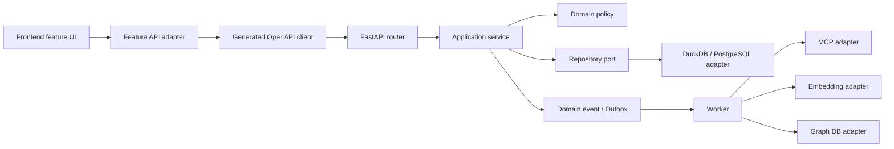

# Luna 실행 사양서: Analysis Canvas 점진적 아키텍처 리팩터링

문서 상태: **실행 기준선 v1**

대상: WSL2 Ubuntu 개발 → Rocky Linux 8 운영, Docker 미사용

목표: 개발 효율성, 기능 안정성, 유지보수성, 독립 기능 개발, 향후 MCP·임베딩·Graph DB 확장성 확보

## 1. Luna가 따라야 할 최상위 명령

1. 이 문서의 작업 패키지를 **번호 순서대로 한 개씩** 수행한다.
2. 한 작업 패키지에서는 동작 보존 리팩터링과 기능 변경을 섞지 않는다.
3. 시작 전에 `git status --short`를 기록하고, 기존 변경 파일은 수정·스테이징·복원하지 않는다.
4. 패키지별 수용 조건과 테스트를 모두 통과한 뒤에만 커밋한다.
5. 커밋은 아래 규칙에 따라 패키지당 하나를 기본으로 한다. 스키마 마이그레이션은 반드시 별도 커밋이다.
6. 서버 권한 검사를 프런트엔드 가시성 검사로 대체하지 않는다. 프런트엔드는 UX, 백엔드는 보안 경계다.
7. 한 번에 `App.tsx`, `main.py`, `database.py` 전체를 재작성하지 않는다.
8. 공개 API, DB 스키마, 권한 의미가 바뀌면 즉시 중단하고 ADR과 호환 계획을 먼저 제안한다.

## 2. 현재 기준선과 확인된 위험

2026-08-12 기준 정적 점검 수치다. 수치는 변경될 수 있으므로 각 패키지 시작 시 다시 측정한다.

| 영역 | 기준선 | 위험 |
|---|---:|---|
| `frontend/src/App.tsx` | 약 2,375줄 | 초기화, 권한별 메뉴, 라우팅, 데이터 로딩, 화면 구현이 결합됨 |
| `frontend/src/styles.css` | 약 1,698줄 | 페이지별 색상 덮어쓰기가 많아 테마 변경이 일부 화면에만 반영될 수 있음 |
| `backend/app/main.py` | 약 2,963줄, 라우트 약 73개 | 라우팅·권한·SQL·도메인 규칙이 한 파일에서 변경 충돌을 만듦 |
| `backend/app/database.py` | 약 2,358줄 | 연결, 스키마, 시드, 조회 책임이 결합됨 |
| `main.py` 직접 `.execute()` | 약 219회 | 트랜잭션과 조회 정책의 일관성 저하 위험 |
| `frontend/src/api.ts` | API 호출 약 78개 | 생성 OpenAPI 클라이언트와 수동 타입/경로가 병존함 |

확인된 P0 동작 위험:

- 프로젝트 또는 분석 가능한 하중 경우가 없으면 앱 초기화가 전역 오류 화면으로 끝난다. 이 상태에서는 권한이 있는 관리자도 데이터 등록 화면으로 진입하기 어렵다.
- 앱 전체가 `overview`, workflow, dashboard 동시 준비를 요구한다. 독립 메뉴가 분석 데이터 상태에 불필요하게 종속된다.
- 권한 상수와 가시성 규칙이 백엔드, 프런트엔드, 마이그레이션 시드에 중복되어 변경 누락 가능성이 있다.
- `general` 역할의 `project.data.view`가 회사 범위인지 프로젝트 멤버십 범위인지 제품 정책을 명시적으로 확정해야 한다.
- production build의 메인 JS가 약 956 kB, CSS가 약 231 kB이며 청크 경고가 발생한다.

## 3. 변경 후 목표 경계



의존성 규칙:

- UI는 다른 feature의 내부 파일을 직접 import하지 않는다. 공개 `index.ts` 또는 shared 계약만 사용한다.
- Router는 HTTP 변환, 인증 컨텍스트, 입력 검증만 담당한다.
- Service는 use case와 트랜잭션 경계를 담당하고 FastAPI 객체를 import하지 않는다.
- Repository는 SQL과 저장소 차이를 감춘다. 도메인 정책은 SQL 문자열을 알지 못한다.
- MCP, 임베딩, Graph DB는 `integrations`의 adapter이며 핵심 도메인이 특정 공급자 SDK를 직접 import하지 않는다.
- 장기 작업은 HTTP 요청에서 직접 실행하지 않고 outbox/job 식별자를 반환한다.

권장 디렉터리 목표:

```text
frontend/src/
  app/                 # bootstrap, shell, providers, route registry
  features/<feature>/  # page, components, hooks, api adapter, tests
  entities/            # Project, Request, LoadCase 등 공용 도메인 타입
  shared/api/          # 인증 fetch, 생성 client, 오류 변환
  shared/ui/           # 테마 토큰을 사용하는 공용 컴포넌트
  shared/theme/        # semantic tokens, ThemeProvider

backend/app/
  routers/             # HTTP boundary
  services/            # application use cases
  repositories/        # SQL adapters
  schemas/             # HTTP DTO
  domain/              # 정책, 값 객체, 이벤트
  integrations/        # MCP/embedding/graph/media/directory adapters
  jobs/                # outbox consumer와 재시도 정책
```

## 4. 변경 불가 계약

- 기존 API URL, HTTP method, 성공 응답 shape, 오류의 핵심 `code`는 호환성을 유지한다.
- 기존 DuckDB와 PostgreSQL 테스트 프로필을 모두 유지한다.
- 프로젝트 권한 검사는 서버에서 resource → project scope를 해석한 뒤 실행한다.
- 비활성·승인 대기 사용자는 보호 API에 접근할 수 없다.
- 테마는 `document.documentElement.dataset.theme`을 단일 전역 상태로 사용한다.
- 색상 토큰 예외는 데이터 시각화 series palette와 사용자 저장 색상뿐이다. 일반 배경·텍스트·경계 색상을 feature에서 직접 선언하지 않는다.
- Windows `.venv`, WSL `.venv-wsl`, Rocky 운영 venv를 서로 복사하거나 공유하지 않는다.
- 운영은 현재 요구대로 Docker를 전제로 하지 않는다.

## 5. 실행 순서와 작업 패키지

### ENV-001 — WSL 기준선

상태: **완료** (`chore(wsl): add reproducible development environment`)

- `./setup-wsl.sh`로 사용자 영역 Node/Python/pnpm을 설치한다.
- `./scripts/wsl/doctor.sh`가 버전과 백엔드 import를 검증한다.
- 권장 작업 위치는 `~/src/simulation_dashboard`다.

수용 조건:

```bash
./scripts/wsl/doctor.sh
pnpm --dir frontend run build
```

### CHAR-001 — 특성화 테스트와 기준선 고정

목적: 파일을 이동하기 전에 현재 동작을 테스트로 잠근다.

작업:

- 빈 DB, 프로젝트만 존재, 의뢰만 존재, 하중 경우만 존재, 분석 결과 존재의 5개 bootstrap 상태를 API/화면 테스트로 만든다.
- global admin, project admin, power, general, pending의 대표 read/write 권한 행렬을 parameterized backend test로 만든다.
- 대표 메뉴 5개(포트폴리오, 데이터, 상세분석, 권한관리, 작업실행)의 dark/light 스크린샷 기준을 만든다.
- 현재 bundle size를 CI artifact에 기록한다. 이 패키지에서는 임곗값으로 실패시키지 않는다.

수용 조건:

- 기존 동작을 바꾸는 production code diff가 없어야 한다.
- 각 테스트 이름에 보호하는 사용자 시나리오가 드러나야 한다.

커밋: `test(characterization): lock bootstrap theme and access behavior`

### FE-010 — 전역 테마 계약

목적: 배경색 하나를 바꾸면 모든 페이지 surface가 동일 토큰을 따르게 한다.

작업:

- `shared/theme/tokens.css`에 semantic token을 정의한다: `--color-app-bg`, `--color-surface-1..3`, `--color-border`, `--color-text`, `--color-text-muted`, `--color-accent`, 상태색.
- `html[data-theme='dark|light']`만 토큰 값을 소유한다.
- `body`, `.app-shell`, `.main-shell`, page root, dialog/drawer의 배경을 토큰으로 전환한다.
- 차트 series 색은 별도 `chartPalette.ts`로 분리한다.
- 새 raw hex가 feature CSS/TSX에 추가되지 않는 lint/check 스크립트를 추가한다.

수용 조건:

- dark/light 전환 후 대표 메뉴 5개의 최외곽 배경, surface, 기본 text computed style이 각 토큰 값과 같다.
- 새 페이지가 page root class 하나만 사용해도 전역 배경을 상속한다.
- 스크린샷 diff와 브라우저 console error가 없다.

커밋: `refactor(frontend): establish semantic theme contract`

### FE-020 — Bootstrap과 App Shell 분리

목적: 데이터가 비어도 허용 메뉴와 등록 기능이 살아 있도록 한다.

작업:

- 인증/bootstrap 상태를 `loading | unauthenticated | pending | ready | degraded | fatal`의 명시적 상태로 만든다.
- 프로젝트·workflow·menu policy는 병렬 로드한다.
- 프로젝트/의뢰/하중 경우/overview/dashboard는 nullable context로 다룬다.
- 독립 메뉴는 자신에게 필요한 데이터만 요구한다. 포트폴리오나 데이터 등록이 overview 준비를 기다리지 않게 한다.
- `AppShell`, `TopBar`, `Sidebar`, `WorkspaceRouter`, `AnalysisContextLoader`를 분리한다.
- 빈 상태 CTA는 권한에 따라 보이되 실제 생성 API는 서버 권한으로 재검증한다.

수용 조건:

- 빈 DB에서 global admin이 데이터 화면을 열고 프로젝트를 생성할 수 있다.
- 프로젝트만 있는 상태에서 의뢰 접수 화면으로 이동할 수 있다.
- 분석 데이터 로드 실패가 권한관리/도움말 등 독립 메뉴를 전역 오류로 막지 않는다.
- bootstrap 네트워크 요청에 불필요한 순차 waterfall이 없다.

커밋: `refactor(frontend): decouple app shell from analysis bootstrap`

### FE-030 — OpenAPI 단일 API 계약

목적: URL과 DTO를 수동으로 중복 선언하지 않는다.

작업:

- `generatedApiClient`를 `shared/api`의 유일한 HTTP client 기반으로 사용한다.
- feature adapter는 생성 타입을 UI 친화 오류/모델로 변환한다.
- `api.ts`는 feature별 adapter로 점진 이전하고, 한 커밋에 한 feature만 옮긴다.
- OpenAPI 생성 후 diff가 있으면 빌드가 실패하도록 `generate:api:check`를 추가한다.

수용 조건:

- 이전한 endpoint의 URL string과 response DTO 수동 선언이 제거된다.
- 401 session-expiry와 서버 error code 변환 동작이 유지된다.
- 생성 파일을 사람이 직접 수정하지 않는다.

커밋 예: `refactor(api): migrate project endpoints to generated client`

### FE-040 — Feature slice 분리

목적: 독립 기능 개발 시 `App.tsx` 충돌을 줄인다.

이전 순서: help/examples → schemas/variables/templates → data/intake → portfolio → analysis/report.

각 slice에 포함할 것:

- `Page.tsx`, `components/`, `hooks/`, `api.ts`, `types.ts`, `index.ts`, 가까운 테스트.
- App에는 route registry와 공용 context wiring만 남긴다.
- feature 간 상태 전달은 URL/route params 또는 typed app event를 사용한다.

수용 조건:

- 한 feature 변경이 다른 feature 내부 파일을 수정하지 않는다.
- 순환 import가 없다.
- 최종적으로 `App.tsx`는 400줄 이하를 목표로 하되 줄 수를 위해 의미 없는 파일 분할을 하지 않는다.

커밋: `refactor(frontend/<feature>): extract isolated feature slice`

### BE-010 — Router 추출

목적: `main.py`의 충돌 면적을 줄이되 동작은 바꾸지 않는다.

이전 순서: catalog/templates → projects/requests/load-cases → results/media → dashboard/report.

작업:

- endpoint 함수와 해당 HTTP DTO만 `routers/<feature>.py`로 이동한다.
- `main.py`는 app lifecycle, middleware, router registration만 소유한다.
- 이 단계에서는 SQL이나 권한 정책을 재작성하지 않는다.

수용 조건:

- OpenAPI JSON의 path/method/schema diff가 없다. 순서·description만 달라지는 diff는 검토 기록을 남긴다.
- 모든 기존 backend test가 통과한다.

커밋: `refactor(backend/<feature>): extract API router`

### BE-020 — Service/Repository 경계

목적: 도메인 규칙과 SQL을 분리하고 DB 이식성을 높인다.

작업:

- router에서 먼저 application service를 호출하게 한다.
- service 함수 입력은 principal/context와 DTO 또는 도메인 값이며 `Request`를 직접 받지 않는다.
- SQL은 repository로 이동하고 transaction은 service use case 단위로 묶는다.
- DuckDB/PostgreSQL dialect 차이는 connection/repository adapter에서만 처리한다.

수용 조건:

- 이전 endpoint router에는 `.execute()`가 없다.
- 권한 검사와 변경이 같은 transaction/connection 문맥에서 수행된다.
- DuckDB 및 PostgreSQL portability test가 통과한다.

커밋: `refactor(backend/<feature>): introduce service repository boundary`

### SEC-010 — 권한 계약 단일화

목적: 역할별 기능 분배를 명시하고 중복 변경을 막는다.

작업 전 필수 결정:

- `general`의 `project.data.view`가 회사 전체 조회인지 프로젝트 멤버 조회인지 제품 책임자가 결정한다.

작업:

- 백엔드 `access_policy.py`를 권한 의미의 canonical source로 둔다.
- `/auth/me` 또는 policy endpoint가 effective permission과 scope를 제공한다.
- 프런트는 권한 문자열을 재구성하지 않고 서버 계약으로 메뉴/버튼을 표현한다.
- 마이그레이션 seed는 canonical policy version과 일치 여부를 테스트한다.
- object ID로 다른 프로젝트 데이터에 접근하는 IDOR 회귀 테스트를 추가한다.

수용 조건:

- 역할 × 기능 × scope 행렬 문서와 parameterized test가 1:1 대응한다.
- 숨겨진 버튼의 API를 직접 호출해도 403과 안정적인 error code가 반환된다.
- global admin 예외는 코드에서 명시적이고 감사 가능하다.

커밋: `refactor(access): centralize permission and scope contract`

### PLAT-010 — 비동기 Job/Outbox 기반

목적: 임베딩, 그래프 투영, 대용량 import, MCP 호출을 HTTP transaction과 분리한다.

작업:

- `outbox_event`, `job`, `job_attempt` 모델과 상태 전이를 설계한다.
- 첫 구현은 DB polling worker로 충분하며 외부 queue 도입을 강제하지 않는다.
- idempotency key, retry/backoff, dead-letter, cancellation, audit 필드를 포함한다.
- 결과 import 완료 시 domain event를 같은 transaction에서 outbox에 기록한다.

수용 조건:

- 동일 이벤트를 두 번 소비해도 결과가 중복 생성되지 않는다.
- worker 장애 후 재시작 시 미완료 job이 복구된다.
- 스키마 변경과 application code는 별도 커밋으로 구분한다.

커밋 예: `feat(platform): add transactional outbox schema`, `feat(platform): add idempotent job worker`

### AI-010 — MCP·Embedding·Graph DB Port

목적: 특정 벤더 없이 미래 기능을 연결할 수 있는 경계를 만든다.

먼저 정의할 port:

- `ToolGateway`: tool 목록, schema 검증, 호출, timeout/cancellation.
- `EmbeddingPort`: model/version, batch embed, dimension, provenance.
- `KnowledgeIndexPort`: upsert/delete/search와 tenant/project filter.
- `GraphPort`: node/edge upsert, traversal query, provenance.

필수 메타데이터:

- `project_id`, source object ID/version, content checksum, parser version, model/provider/version, created_at, access scope.

수용 조건:

- 핵심 service test는 in-memory fake adapter로 실행된다.
- adapter가 없어도 기존 앱 시작과 핵심 기능이 정상 동작한다.
- 검색/그래프 결과는 원본 객체와 권한 scope로 재검증된다.
- MCP tool 입력은 Pydantic/JSON Schema 검증, timeout, 크기 제한, 감사로그를 거친다.

커밋: `feat(integrations): define knowledge and tool ports`

## 6. 테스트 게이트

각 production code 패키지의 최소 게이트:

```bash
./scripts/wsl/doctor.sh
(cd backend && ../.venv-wsl/bin/python -m pytest -q)
pnpm --dir frontend run build
```

렌더링 변경 시 추가 게이트:

- 로그인 또는 로컬 인증 상태를 명시한다.
- dark/light 각각 대표 경로를 직접 연다.
- 로딩 종료, non-blank content, blocking overlay 부재, console error 부재를 확인한다.
- 테마 토글과 해당 패키지의 핵심 상호작용을 각각 한 번 이상 수행한다.
- 검증 스크린샷을 test artifact로 남긴다.

DB/권한 변경 시 추가 게이트:

- DuckDB 전체 테스트.
- PostgreSQL portability/startup 테스트.
- 역할별 허용/거부 API 테스트.
- schema 변경이면 upgrade와 rollback 또는 복구 절차 검증.

## 7. Git 및 변경량 규칙

- 작업 시작: `git status --short`, `git diff --name-only` 저장.
- 스테이징: 파일 경로를 명시한다. `git add .`와 `git add -A`를 사용하지 않는다.
- 패키지 외 기존 변경은 절대 커밋하지 않는다.
- 권장 최대 크기: production code 500 changed lines 또는 12 files. 초과하면 하위 패키지로 나눈다.
- 이동과 내용 변경이 크면 먼저 `move-only`, 다음 커밋에서 동작 변경을 한다.
- 생성 OpenAPI, lockfile, migration은 원인을 설명할 수 있을 때만 포함한다.

커밋 prefix:

- 환경: `chore(wsl): ...`
- 사양/ADR: `docs(architecture): ...`
- 동작 보존: `refactor(<scope>): ...`
- 테스트만: `test(<scope>): ...`
- 신규 기능: `feat(<scope>): ...`
- DB 스키마: `feat(db): ...` 또는 `fix(db): ...`

## 8. 중단 조건

다음 중 하나면 Luna는 임의 결정하지 말고 사용자에게 보고한다.

- 권한 scope 의미가 제품 정책 없이는 결정되지 않는다.
- 기존 공개 API/DB schema를 깨야만 다음 단계가 가능하다.
- 동일 테스트 실패가 깨끗한 재실행에서도 재현된다.
- 기존 미커밋 변경과 같은 줄을 수정해야 한다.
- 데이터 삭제, migration rollback, 운영 credential 또는 외부 서비스 쓰기가 필요하다.
- 작업 패키지가 두 개 이상의 독립 목표로 팽창한다.

## 9. Luna 완료 보고 형식

각 패키지 종료 시 아래 형식으로 보고한다.

```text
패키지: FE-020
결과: 완료 | 부분 완료 | 중단
사용자 관점 변화: ...
변경 파일/경계: ...
권한/API/DB 영향: 없음 | 상세
검증: 명령과 결과
남은 위험: ...
커밋: <hash> <message>
다음 권장 패키지: ...
```

## 10. 전체 완료 정의

- 빈 데이터부터 완성된 분석까지 모든 bootstrap 상태가 접근 가능한 메뉴를 막지 않는다.
- 테마의 일반 surface/text/border가 semantic token 하나의 변경으로 전체 화면에 반영된다.
- 역할별 기능과 scope가 문서, 서버 정책, 자동화 테스트에서 일치한다.
- frontend feature와 backend feature가 서로 독립된 파일 경계를 가져 병렬 개발 충돌이 감소한다.
- router에 SQL이 없고 application service가 use case와 transaction을 소유한다.
- MCP·임베딩·Graph DB는 선택 가능한 adapter이며 설치하지 않아도 핵심 앱이 동작한다.
- WSL과 Rocky 환경에서 동일한 명시 버전 및 dependency contract로 빌드·테스트할 수 있다.
