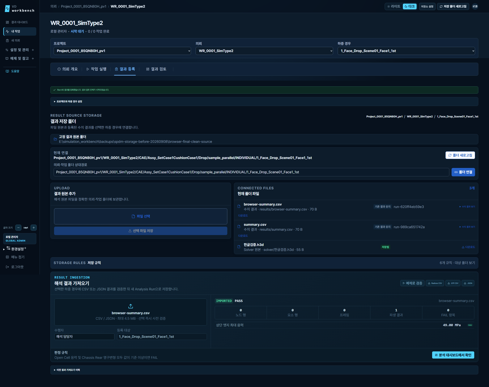
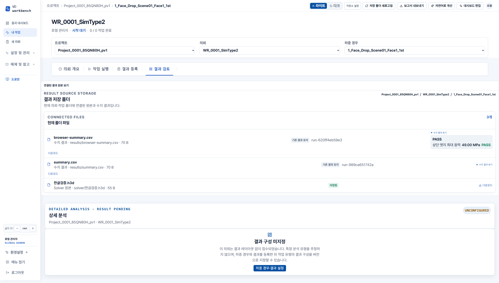

# SPDM 저장소 검증 기록

- 날짜: 2026-09-08
- 상태: 구현 완료, Windows 로컬 검증 통과
- 환경: native Windows, Python 3.12.13, DuckDB, Node.js 22.23.2
- Browser plugin not available: 앱 내 브라우저로 실제 흐름을 확인하고, 저장소의 Playwright 테스트로 반복 검증한다.
- 수동 QA: `http://127.0.0.1:18174`, API `http://127.0.0.1:18081`; 업무 DB와 분리한 `backups/spdm-storage-before-20260908/browser-final-clean.duckdb` 사용.

## 수용 기준

| 흐름 | 확인 사항 |
|---|---|
| 최초 설정 | root 미설정 안내 → 관리자 root 저장 → 경로 연결 가능 |
| 폴더 발견 | #13 Project/WR/CAE/해석/Scene 구조 → 올바른 프로젝트·의뢰·하중 경우 |
| 직접 저장 | marker 없이 복사 완료한 Windows CSV → 수치 Run |
| 중복·변경 | 같은 파일 재탐색은 같은 Run; 수정본은 새 Run; 기존 이력 보존 |
| 웹 등록 | 저장 위치 표시 → 실제 파일 저장 → 동일 등록 경로의 Run |
| 원본 | H3D·보고서 다운로드, 수치 Run 생성 없음, 한글 파일명 보존 |
| 복사 중 | Windows writer handle이 열린 파일은 대기, 완료 후 재시도 |
| 실패 복구 | 저장/DB 실패 시 원본·기존 결과 보존 및 재시도 |
| 권한 | root·전체 탐색은 관리자, 조회와 등록 권한 분리, 다른 과제 접근 차단 |
| UI | 대시보드→폴더 새로고침→의뢰→결과 등록/검토, 오류 overlay·가로 넘침 없음 |

## 실행 기록

`backups/spdm-storage-before-20260908/smoke.py`에서 제공 예제의 첫 발견·Run #1 등록과 반복 새로고침의 동일 Run 재사용을 확인했다.

- SPDM backend 전용 회귀: **20/20 통과**. 구조화·원본 업로드, 수정본/재시도, 한글 다운로드, 보고서 개별·누적 분리, viewer 조회와 등록 권한, parent registry 재사용/충돌, root 변경, Windows writer handle, 실패 복구, 삭제 폴더와 이력 보존을 포함한다.
- Backend 구조 검사와 DuckDB→PostgreSQL 이관 회귀: **31/31 통과**.
- PostgreSQL `0019_batch_recovery_lease → 0020_spdm_storage` 오프라인 SQL 생성 통과. 실제 PostgreSQL 서버에서 migration을 실행한 결과는 아니다.
- OpenAPI 의미 비교: 기존 endpoint·schema 변경/삭제 없음. SPDM endpoint 8개 추가.
- 실제 브라우저: 저장소 설정 → 폴더 발견 → 의뢰 → 한글 H3D 이름의 시험 attachment 업로드·바이트 동일 다운로드 → CSV Run → 새로고침 시 같은 Run 유지 → 결과 검토에서 원본과 **49.00 MPa** 수치 조회 통과. 2560×1440과 390×844, 다크·라이트에서 가로 넘침·페이지 오류 없음. H3D 내용 해석을 검증한 테스트가 아니라 원본 바이트 보존 검증이다.
- 프런트엔드 build, 구조 검사(112개 소스, 검토된 예외 import 5개), API self-test 통과.
- 저장소 E2E **2/2 통과**. 실제 파일 전송·한글 다운로드 바이트, 직접 복사, Run 중복 방지와 이전 하중 경우의 지연 응답 차단을 확인했다.
- 기존 의뢰·통합 탭 E2E 26개 중 25개가 첫 실행에서 통과했다. 저장소 연결이 빠진 등록 화면 시험 설정을 보완한 뒤 해당 1개 재실행도 통과했다.
- 최종 통합 재검증 **3/3 통과**: 저장소 E2E 2개와 등록 문맥 변경 1개를 동일 runner에서 실행했다. 시험 설정이 기존 저장소 root를 재사용하여 묶음 실행 시 설정 충돌도 방지한다.

## 화면 검증

| 항목 | 결과 |
|---|---|
| 페이지 식별·빈 화면 | 의뢰의 결과 등록/검토 URL과 실제 파일 목록 확인 |
| framework overlay·페이지 오류 | 없음 |
| 원본 업로드 전송 | generated client의 JSON 직렬화 오류를 수정하고 깨끗한 시험 DB에서 업로드 응답 크기 55 B와 다운로드 바이트 일치 확인 |
| 수치 조회 | 파일에 연결된 Run의 실제 값·단위·판정 조회, 프로파일 추정 없음 |
| 와이드·모바일 | 2560×1440, 390×844에서 가로 넘침 없음 |
| 시각 수정 | 다크 입력 대비, 업로드/파일 목록 2열, 저장 규칙 기본 접기, 전체 경로 줄바꿈 |

## 실제 사내 확인 범위

이 환경에는 사내 SMB/UNC 공유가 연결되어 있지 않다. Windows 로컬 파일시스템 검증과 사내 공유의 권한·파일 잠금·파일 게시 지원 검증은 구분한다. 사내 배치 후 운영 계정으로 업로드 → 탐색기 파일 확인 → 새로고침을 한 번 확인한다.
